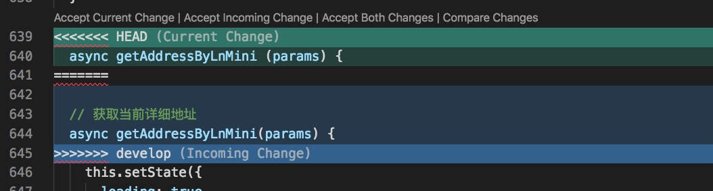
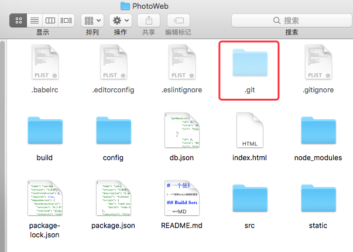
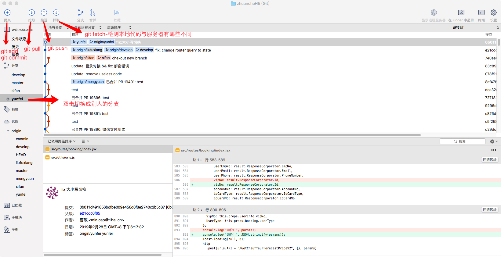
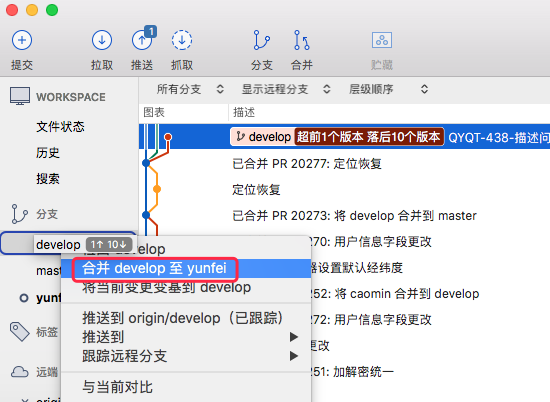
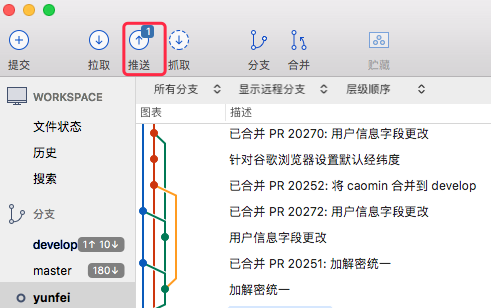
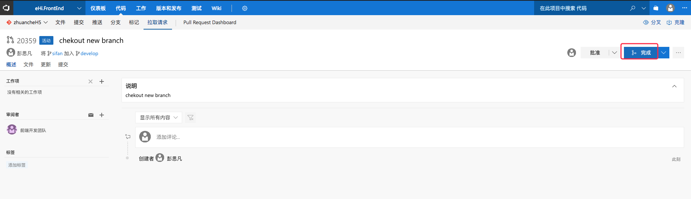
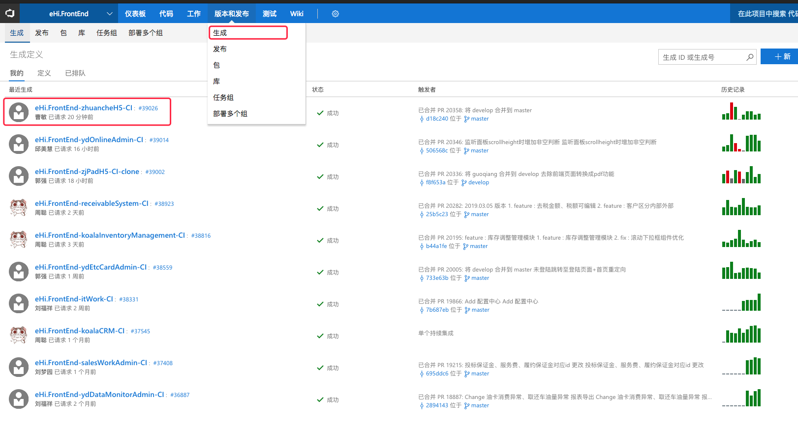
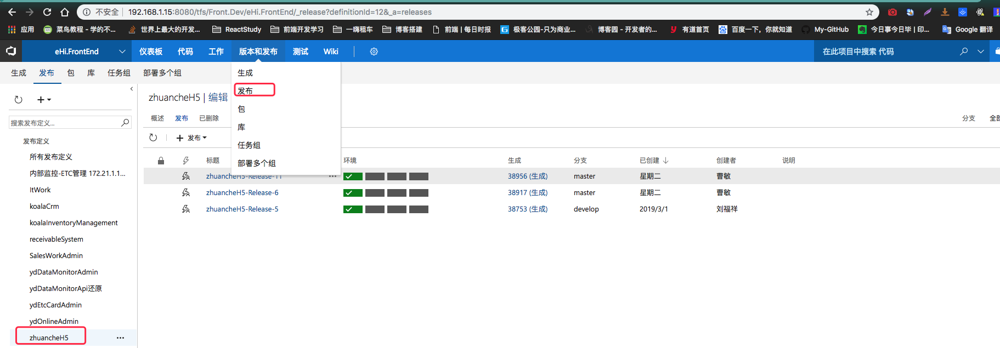

- [第一章、前言](./doc/chapter1.md)
- [第二章、创建版本库](./doc/chapter2.md)
- [第三章、工作区和暂存区](./doc/chapter3.md)
- [第四章、版本](./doc/chapter4.md)
- [第五章、管理修改](./doc/chapter5.md)
- [第六章、撤销修改](./doc/chapter6.md)
- [第七章、删除文件](./doc/chapter7.md)
- [第八章、远程仓库](./doc/chapter8.md)
- [第九章、从远程库克隆](./doc/chapter9.md)
- [第十章、分支管理](./doc/chapter10.md)
- [第十一章、分支管理策略](./doc/chapter11.md)
- [第十二章、Bug 分支](./doc/chapter12.md)
- [第十三章、Featuer 分支](./doc/chapter13.md)
- [第十四章、多人协作](./doc/chapter14.md)
- [第十五章、Rebase](./doc/chapter15.md)
- [第十六章、标签管理](./doc/chapter16.md)
- [第十七章、操作标签](./doc/chapter17.md)
- [第十八章、使用 GitHub](./doc/chapter18.md)
- [第十九章、自定义 Git，让工作更高效](./doc/chapter19.md)
- [第二十章、忽略特殊文件](./doc/chapter20.md)
- [第二十一章、配置别名](./doc/chapter21.md)
- [第二十二章、搭建 Git 服务器](./doc/chapter22.md)
- [第二十三章、使用 GitHub 进行团队协作](./doc/chapter23.md)

---

# Git 和 GitHub 学习资料

**Git**

- [Git-Book 官方文档](https://git-scm.com/book/en/v2)
- [git-简明指南 罗杰·杜德勒](http://rogerdudler.github.io/git-guide/index.zh.html)
- [git 详细学习](https://git-scm.com/book/zh/v2)
- [Learn Git Branching 通过一系列刺激的关卡挑战，逐步深入的学习 Git 的强大功能](https://learngitbranching.js.org/)
- [猴子都能懂的 GIT 入门](https://backlogtool.com/git-tutorial/cn/)
- [代码提交规范](doc/SubmitSpecification.md)
- [GitLab 搭建与总结](doc/GitLab.md)
- [Learn Git Branching 通过一系列刺激的关卡挑战，逐步深入的学习 Git 的强大功能](https://learngitbranching.js.org/)
- [QA](doc/QA.md)

**GitHub**

- [GitHub 漫游指南 Phodal Huang,黄峰达,ThoughtWorks 高级咨询师](https://github.phodal.com/#/chapter/Github%E6%BC%AB%E6%B8%B8%E6%8C%87%E5%8D%97)
- [GitHub 秘籍](https://www.bookstack.cn/read/github-cheat-sheet/README.md)

# 切远程提示 lock 解决方案

`git gc --prune=now`

# 分支被弄脏后的解决方案

- 从最新 master 分支拉取代码建立新分支
- 将原本分支需要的代码，cherry-pick 到新分支 git cherry-pick 对应 commit
- 遇到冲突，解决冲突
- 冲突解决后 git cherry-pick —continue

# GitHub 这样玩

快捷下载软件，找到对应仓库-releases-点击对应版本下载

## 如何在 Gihub 上面精准搜索开源项目？

一个开源项目有哪些组成部分：

- name: 项目名
- description: 项目的简要描述
- 项目的源码
- README.md: 项目的详细情况的介绍

## 评判一个开源项目是否火热的标准

项目本身的 star 数和 fork 数

# GitHub 项目邀请（添加）成员

- https://blog.csdn.net/qq_36761831/article/details/91531784

# Git 冲突解决方案

以 IDEA 开发工具为例
Upadate-Commit-Push 之后文件出现冲突
`<<<<<<<` 这个箭头代表本地的文件
`>>>>>>>` 这个箭头代表服务器的文件
删除这些箭头之后再次更新
出现这个图标

点击 Merge

在这个图片中 Your version 是自己改的
Changes from server 为服务器的
选择不需要或者需看`X >>`
`X`代表删除
`>>`代表接受
把每一个冲突全部点选之后 Result 就是最终要提交的代码
全部整改完之后 Merge，然后再次 Commit-Push 即可。

## vscode 解决冲突

1.点开冲突文件在冲突位置会有提示

Accept Current Change|Accept Incoming Change|Accept Both Changes|Compare Changes
含义依次为：
以本地代码为主|以服务器代码为主|接受本地和服务器全部代码|比较冲突 2. 修改点选每一次冲突 之后就可以合并了 3.解决冲突时切记自己和别人都改动提交的地方一定要和对方确认一下 哪些代码是不可以留的，哪些需要留着的

# vscode 实现 Git 版本控制

## 1.1 初始化

1.先创建一个名为 PhotoWeb 的文件夹，当然它不在 git 的版本控制管理中。
 2.用 VS Code 打开终端（Command+shift+Y）用 git init 初始化 git 仓库 3.通过 git add .添加当前目录下的所有文件
通过 xxx 添加单个文件 4.执行上传到 git 仓库命令 git commit -m "可写注释内容"
5.vs code 左侧打开 GIT 图标，在上方有提交和刷新按钮，下拉菜单里有更多选项。 6.回到我们的文件中，刚才的操作创建了一个.git 文件夹，放置了当前仓库的所有配置文件


## 连接 GitHub 远程代码仓库

1.在 github 上创建一个 Repository，复制地址https://github.com/EdisonVan/PhotoWeb备用。
 2.终端执行下面命令
git remote add origin https://github.com/你的github的用户名/PhotoWeb.git（PhotoWeb.git为你创建的仓库名字加上.git）
第一次提交为防止失败先用下面这行命令将 github 上的 README.md 文件拉下来
`git pull --rebase origin master`
然后`git push -u origin master`执行推送到 master 主分支 3.现在查看一下.git 文件夹下的 config 文件，可以看到添加了远程 Reps 地址。
 4.接下来从下拉菜单中执行发布命令。会提醒我们输入账号和密码。

输入之后，会把本地提交的文件同步到 github。同步之后再打开 git 的隐藏菜单，可以看到 同步等命令可以直接使用了。

## 简化提交方法

使用 git 的 clone 命令，从远程克隆一个 Reps，然后直接用 vscode 打开文件夹，VS Code 会自动识别各项配置。

## 持久化账号（不推荐）

远程连接 git 的问题解决了，如果你不想每次同步时都输入账号信息，可全局存储账号。
Command+shift+P，输入 git config --global credential.helper wincred

## 提交保存


## git 命令列表

Command+shift+P，输入 git，会看到 VS CODE 支持的所有 git 命令。


## 撤销操作

Command+shift+P 后，输入 git undo Last Commit 撤销上次操作。输入 Unstage,撤销暂存。

## 分支

Command+shift+P 后，输入 Branch 可以创建当前内容的分支。创建分支时需要输入分支名称。

## 删除远程以及本地分支

```bash
git push origin --delete xxx
git branch -D xxx
```

## checkout

创建分支后，使用 checkout 命令可以拉取特定的分支内容。

## 冲突合并

VS Code 会检测文件冲突，并以<<<<<,>>>>,====和颜色区分出来。解决冲突之后，直接提交就行了。

## 文件比较

在 git 文件列表中，单击一个未提交更改的文件，就会打开两个窗口来显示变更的内容。

# GitHub 代码下载操作

打开你要存放的文件夹，vscode 上 Command+Shift+Y 打开终端，直接输入命令
git clone http://github.com/用户名/github上你要clone的项目名称

# git 版本管理工具

## 基本操作



## 提交操作


注意：使用 https 地址每次 都要输入账号密码，但是使用 SSH 就不用

# 开发

# 代码提交注意事项 （Add git）

## 代码提交推荐操作

1. git pull origin develop:sifan 从远程 develop 分支拉取代码到 sifan（自己的）分支
2. git add . 本地代码全部更改提交到缓存区
3. git commit -m "Change" 提交信息
4. git push origin sifan 推代码到自己的远程分支
5. 查看 tsf 是否 存在超前，如果存在超前需要在 tfs 上提交一个 Pr
   
   右侧点击新建拉取请求
   选择从 sifan 到 develop 进行合并（切记不要勾选合并后删除自己的分支）
6. Pr 提交之后，再看 tfs 中超前的数字是否消失，如果消失继续接下来操作
7. git pull origin develop:sifan 从远程 develop 分支拉取代码到 sifan（自己的）分支
8. git push origin sifan / git push —set-upstream origin 再次推送代码到自己的远程分支
9. 最后再次在 tfs 检查自己是否有超前或者落后

## SourceTree 提交代码（不太推荐）

1.自己分支上修改代码先提交
 2.双击切换到 develop 分支，点击拉取代码
 3.双击切换回自己的分支， 点击 develop 右键合并 develop 到自己的分支
 4.自己分支合并完 develop 内容后，再次推送一次
 5.公司 tsf 上将自己的分支内容合并到 develop/master 上，任意一个分支中点击新建拉取请求
 6.选择好自己的分支合并到 develop 上，点击创建
 7.点击完成
 8.合并之后点生成，看自己合并的有没有生产
 9.确定已经生产了再点击发布
 10.发布之后告知测试/后端已经发布可以部署

# GitHub 使用指南

- fork：拷贝别人项目到自己帐号下
- star：关注别人项目更新
- watch：设置接收邮件提醒
- issue：仓库问题、需求、修复的 bug 集合
  - 通过给 issue 打标签进行分类会更简洁

## GitHub 提 Pr 方法

一般在 fork 别人仓库之后进行代码修改，修改好了需要合并到别人的仓库中，必须要提 Pr。
所谓提 Pr 就是在 GitHub 仓库中点击`New pull request`按钮


## 组织创建(Team management)

- 建立团队
- 对不同仓库授予不同权限

## 文档(Documentation)

- GitHub Page
  - 做博客
- wikis
  - 功能说明手册

## 在 GitHub 高效查找优质项目

- Advanced search(高级搜索功能)
  - Advanced options
    - Created on the dates 创建时间范围
  - Repositories options 根据仓库属性进行搜索
  - Code options 根据 Code 选项，仓库里面带.xx 后缀文件的仓库
- start 越多越好

### 高级搜索

- `create:<2019-03-01`
  **创建在 3 月 1 日之前的仓库，<2019-03-01**
- `git 最好 学习 资料 in:readme`
  表示：搜索 git 仓库，项目 README 文件描述有关键字为‘最好 学习 资料’
  **所以自己的项目 README 文件一定要认真写**
- `git 最好 学习 资料 in:readme stars:>1000`
  代表必须大于 1000 个 Star 的项目仓库
  更多操作可以在 Advanced search 里填写设置之后再搜索
- 'after_script:'+'stage:deploy' filename:.gitlab-ci.yml
  搜索.gitlab-ci.yml 文件中包含‘after_script:’和‘stage:deploy’代码的仓库，根据 filename 进行搜索只会根据代码的内容来搜索，只会搜出代码
- `blog easily start in:readme stars:>5000`
  搜索搭建博客的仓库，且星级超过 5000 个
  搜索项目名里面包含 React 的项目:
- `in:name React`
  精确到项目的 star 数大于 5000+：
- `in:name React stars:>5000`
  按照 fork 的数量来进行搜索:
- `in:name React stars:>5000 forks:>3000`
  按照 README 来搜索 README.md 里面包含 React 的项目
- `in:readme React`
  限制一下它的 star 数和 fork 数：
- `in:readme React stars:>3000 forks:>3000`
  按照 descriptin 搜索微服务项目
- `in:description 微服务`
  增加一些筛选条件,把语言限制为 python
- `in:description 微服务 language:python`
  找到近期更新项目
- `in:description 微服务 language:python pushed:>2020-01-01`
  pushed:>2020-01-01 的意思是我们把项目的最后更新时间限制到 2020-01-01

### 拓展

GitHub 底部的 Help 点进去有很多完备的资料可供学习使用 GitHub
Com+F 搜索`Searching for information onGitHub`可以看到更多关于 GitHub 搜索的功能

## 开源项目质量如何保证

`Pull requests`可以看自己或其他用户对开源项目的代码提交以及次数

### 个人如何向开源项目提交代码

在对应仓库下的`Pull requests`选项，点击`New pull request`来新建一个代码提交申请

- merge 进去的会是紫色
- 被拒绝的会是红色
- 在 Pull requests 下输入`is:pr is:open`进行搜索，得到的是正在申请还未被采纳合并的
- 点进请求中
  - 看`自动化测试`Checks 进行过几次，没有说明没检测，有次数点进去能看到具体检测了哪些内容
  - `Conversation`为 Code Review 时进行的讨论

# 临更（回退）

- 找到上线版本的 commit 或 tag：假设为 aaa
- 切一个临更分支 hotfix：git checkout -b hotfix aaa
- 在 hotfix 上开发，正常提交，push 至远程的 hotfix 分支
- 创建新的生成，选择分支为 hotfix，发布
- 合并 hotfix 至 master 和 develop

# 极课-玩转 git 三剑客

Settings-Organizations 自己去点每一个选项玩耍

# [怎样选择适合自己团队的工作流？](doc/team-work-flow.md)

# [git 为不同的项目设置不同的用户名](https://www.jianshu.com/p/d3f80a1246d6)

# 更新远程分支列表

`git remote update origin --prune`

- [分支重命名](doc/feature.md)
