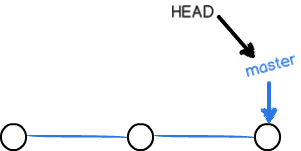
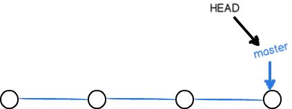
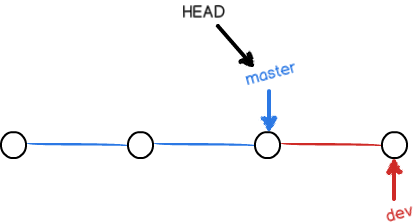
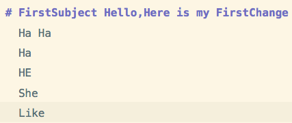
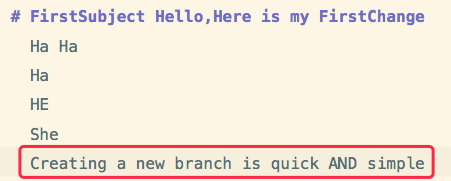
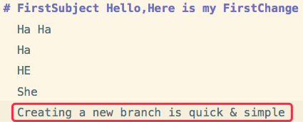
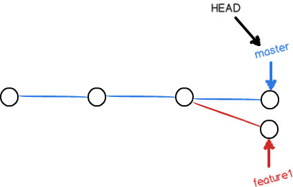
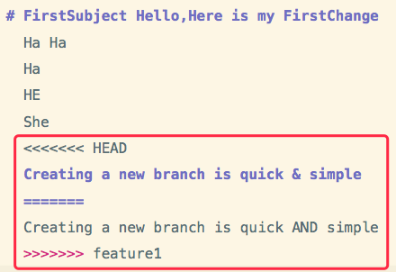
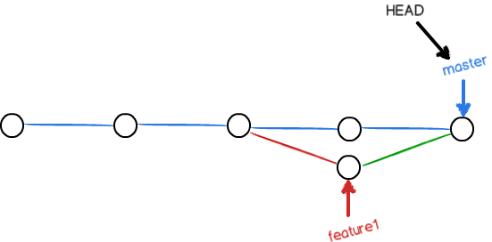

# 一、Git 分支

创建了一个属于你自己的分支，别人看不到，还继续在原来的分支上正常工作，而你在自己的分支上干活，想提交就提交，直到开发完毕后，再一次性合并到原来的分支上，既安全，又不影响别人工作。Git 的分支是与众不同的，无论创建、切换和删除分支，Git 在 1 秒钟之内就能完成！无论你的版本库是 1 个文件还是 1 万个文件。


# 二、创建与合并分支

## 2.1 图解

每次提交指向 ` master` ， `HEAD` 指向的就是当前分支。
一开始的时 `master` 分支是一条线，Git 用 `master` 指向最新的提交，再用 `HEAD` 指向 master，就能确定当前分支，以及当前分支的提交点



每次提交，`master` 分支都会向前移动一步，你不断提交，`master` 分支的线也越来越长：
创建新的分支，如 `dev`，Git 新建了一个指针叫 `dev`，指向 `master` 相同的提交，再把 `HEAD` 指向 `dev`，就表示当前分支在 `dev` 上


Git 创建一个分支很快，因为除了增加一个 `dev` 指针，改改 `HEAD` 的指向，工作区的文件都没有任何变化！

从现在开始，对工作区的修改和提交就是针对 `dev` 分支了，新提交一次后，`dev` 指针往前移动一步，而 `master` 指针不变


假如我们在 dev 上的工作完成了，就可以`直接把 master 指向 dev 的当前提交` 来把 `dev` 合并到 master 上。


Git 合并分支也很快！就改改指针，工作区内容也不变！

合并完分支后，甚至可以删除 `dev` 分支。删除 `dev` 分支就是把 `dev` 指针给删掉，删掉后，我们就剩下了一条 `master` 分支



## 2.2 实战过程

- 1.用 `git checkout -b dev `先创建 `dev` 分支，然后切换到 `dev` 分支：


`git checkout` 命令加上 `-b 参数表示创建并切换`，相当于以下两条命令：

```
git branch dev
git checkout dev
```

- 2.用 `git branch` 命令查看当前分支。


- `git branch` 命令会列出所有分支，当前分支前面会标一个`\*`号。

- 3.在 `dev` 分支上正常提交，比如对 README.md 做个修改，加上一行
  `Here is my FirstChange`


然后提交


- 4.现在 `dev` 分支的工作完成，我们就可以用 `git checkout master` 切换回 `master` 分支


切换回 `master` 分支后，再查看一个 README.md 文件，刚才添加的内容不见了！因为那个提交是在 `dev` 分支上，而 `master` 分支此刻的提交点并没有变




- 5.现在用 `git merge dev` 把 `dev` 分支的工作成果合并到 `master` 分支上


`git merge` 命令用于合并指定分支到当前分支。合并后，查看 README.md 的内容，就可以看到和 `dev` 分支的最新提交完全一样。

注意到上面的 `Fast-forward` 信息，Git 告诉我们，这次合并是`快进模式`，也就是直接把 `master` 指向 `dev` 的当前提交，所以合并速度非常快。当然不是每次合并都能 `Fast-forward`。

- 6.合并完成后，就可以放心地删除 `dev` 分支了

```
git branch -d dev
```


- 7.删除后，`git branch` 查看 `branch`，就只剩下 `master` 分支了


因为创建、合并和删除分支非常快，记得`合并后再删掉分支`，这和直接在 `master` 分支上工作效果是一样的，过程更安全

## 2.3 小结

- Git 鼓励大量使用分支：

```bash
查看分支：           git branch
创建分支：           git branch <name>
切换分支：           git checkout <name>
创建+切换分支:       git checkout -b <name>
合并某分支到当前分支  git merge <name>
删除分支：           git branch -d <name>
```

# 三、解决冲突

- 1.`git checkout -b feature1` 准备新的 `feature1` 分支，继续我们的新分支开发




- 2.修改 `readme.txt` 最后一行



- 3.在 `feature1` 分支上用 `git add README.md` 和 `git commit -m "AND simple"`提交：


- 4.`git checkout master` 切换到 `master` 分支：


Git 还会自动提示我们当前 `master` 分支比远程的 `master` 分支要超前 1 个提交。

- 5.在 `master` 分支上把 README.md 文件的最后一行改为：`Creating a new branch is quick & simple.`



- 6.提交


- 7.现在，`master` 分支和 `feature1` 分支各自都分别有新的提交，变成了这样



这种情况下，Git 无法执行`快速合并`，只能试图把各自的修改合并起来，但这种合并就可能会有冲突


Git 告诉我们，README.md 文件存在冲突，必须手动解决冲突后再提交。

`git status` 也可以告诉我们冲突的文件

```
git status
```


- 8.直接查看 `readme.txt` 的内容：



Git 用`<<<<<<<`，`=======`，`>>>>>>>`标记出不同分支的内容，我们修改如下后保存：

```
Creating a new branch is quick and simple.
```

再提交


- 9.现在，`master` 分支和 `feature1` 分支变成了下图所示：



用带参数的 `git log` 也可以看到分支的合并情况：

```
git log --graph --pretty=oneline --abbrev-commit
```


最后，删除 `feature1` 分支：

```
git branch -d feature1
```


# 四、小结

- 当 Git 无法自动合并分支时，就必须首先解决冲突。。
- 解决冲突就是把 Git 合并失败的文件手动编辑为我们希望的内容
- 解决冲突后，再提交，合并完成
- 用 `git log --graph` 命令可以看到分支合并图。
