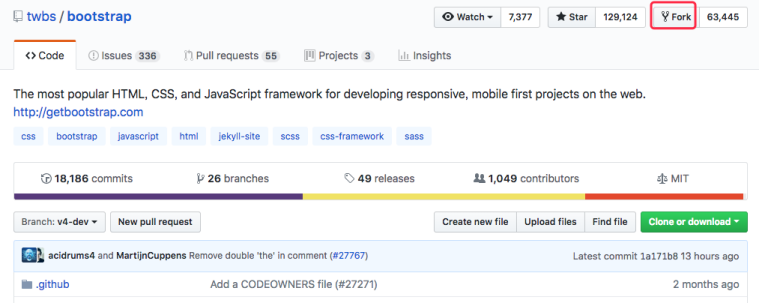
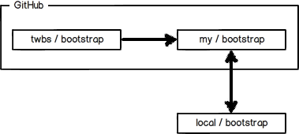

个人的开源项目，放到 GitHub 上是完全没有问题的。

GitHub 还是一个**开源协作社区**，通过 GitHub，既可以让别人参与你的开源项目，也可以参与别人的开源项目。

# 一、如何参与一个开源项目呢？

比如 CSS 框架 `bootstrap` 项目，你可以访问[项目主页](https://github.com/twbs/bootstrap)

- 1.点 `Fork` 就在自己的账号下克隆了一个 `bootstrap` 仓库



- 2.从自己的账号下 `clone`

```bash
git clone git@github.com:EdisonVan/bootstrap.git
```

(一定要从**自己的账号**下 clone 仓库，这样才能推送修改)

Bootstrap 的官方仓库 `twbs/bootstrap` 、你在 GitHub 上克隆的仓库 `my/bootstrap` ，以及你自己克隆到本地电脑的仓库，他们的关系就像下图显示的那样：



- 如果你想修复 `bootstrap` 的一个 `bug` ，或者新增一个功能，立刻就可以开始干活，干完后，往自己的仓库推送。

- 如果你希望 `bootstrap` 的官方库能接受你的修改，你就**可以在 GitHub 上发起一个 `pull request`**。

- 如果你没能力修改 `bootstrap`，但又想要试一把 `pull request`，那就 `Fork` 一下同伴的仓库 **`https://github.com/Friends/subject`** ，创建一个 **`your-github-id.txt`** 的文本文件，然后推送一个 `pull request` 过去，同伴接受即可。

# 二、小结

- 在 GitHub 上，**可以任意 Fork 开源仓库**
- **自己拥有 Fork 后的仓库的读写权限**
- 可以推送 `pull request` **给官方仓库来贡献代码**
