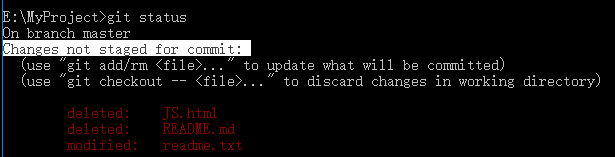
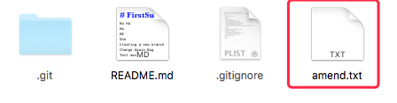
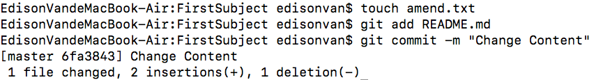
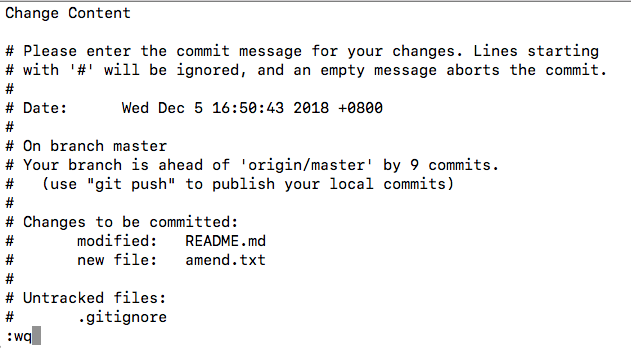
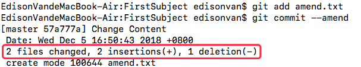

## Window

- 在 cmd 中找到一个盘符
- E:回车到 E 盘，mkdir GitKu
- 然后在对应目录下创建一个子文件 MyGitKu.

（在我的 PC 上，这个仓库位于 `E:\GitKu\MyGitKu`）

（多了一个`.git `的目录，这个目录是 Git 来跟踪管理版本库的，没事千万不要手动修改这个目录里面的文件，不然改乱了，就把 Git 仓库给破坏了)

## MAC

- 选择一个合适的地方，创建一个空目录：

```
mkdir GiKu
cd GiKu
pwd pwd 命令用于显示当前目录
/Users/michael/learngit
```

(在我的 Mac 上，这个仓库位于`/Users/edisonvan/GiKu`)

请确保目录名（包括父目录）不包含中文

- 通过 `git init` 命令把这个目录变成 Git 可以管理的仓库

(如果你没有看到文件夹下面多了`.git` 目录，是因为这个目录默认是隐藏的，用 `ls -ah` 命令就可以看见。)

# 一、把文件添加到版本库

```
mac 用 Xcode
windows 用 Notepad++ 来编写记事本
记得把 Notepad++ 的默认编码设置为 UTF-8 without BOM 即可
```

编写的文件一定要放到`相应（比如GitKu）目录下（子目录也行）`

## 把一个文件放到 Git 仓库

- 用命令`git add`告诉 Git，把文件添加到仓库

- 用命令`git commit`告诉 Git，把文件提交到仓库

  (用`git commit -m`命令，` -m`后面输入的是本次提交的说明，方便日后从历史记录找到改动记录)

- `file changed`:1 个文件被改动（即新添加的`readme.txt `文件）
- `insertions` ：插入了两行内容（`readme.txt` 有两行内容）

# 二、提交多个文件

```
git add file1.txt
git add file2.txt file3.txt
git commit -m "add 3 files."
```

(`commit` 可以一次提交很多文件，所以你可以多次 `add `不同的文件)

# 三、步骤小结

- 初始化一个 Git 仓库，使用 `git init` 命令。
- 添加文件到 Git 仓库，分两步：
  - 使用命令 `git add < file >`
    (注意，可反复多次使用，添加多个文件)
  - 使用命令 `git commit -m < message >`，完成。



上面的命令输出告诉我们，`readme.txt` 被修改过了，但还没有准备提交的修改

# 四、修改最后一次提交

`git commit -–amend+回车`

## 情景 I：

- 如果发现最后一次的提交出现了错误，需要重新提交，就可以用`git commit --amend`。

- 如果已经提交了`README.md`，但是发现还有一个新文件需要一块提交




这时就要先把新文件放到暂存区，用 `git add amend.txt`

再使用命令 `git commit --amend`，如果出现了一种编辑的模式



直接输入:`wq `然后按回车, 新添加到暂存区的文件就被放到同一次提交里面了。



# 情景 II：

如果是不是添加新的文件，只是觉得在最后一次提交时有的文件没有修改完全.

那就在修改完了之后，把修改的文件用` git add` 加到暂存区，其他的步骤跟上面是一模一样的。

# 情景 III：

如果仅仅是想修改一下最后一次提交的提交信息，那就输入 `git commit --amend -m ""`新的提交信息"即可

# 情景 IV：

如果修改之后需要上传到 GitHub，有两种情况：

- 如果第一次` commit`（未` amend`）时就已经 `push` 到 Github 了，这时在修改和重新提交之后的 push 需要加上`--force` 参数，即 `git push --force `
- 如果第一次 `commit` 之后没有` push` 到 GitHub，那么就没有影响。
