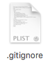

有时候必须把某些文件放到 Git 工作目录中，但又不能提交它们

比如保存了数据库密码的配置文件，每次 `git status` 都会显示 **`Untracked files ...`**。

**解决方案**

- 在 Git 工作区的根目录下创建一个特殊的 `.gitignore` 文件，然后把要忽略的文件名填进去，Git 就会自动忽略这些文件。



不需要从头写 `.gitignore` 文件，GitHub 已经为我们准备了各种配置文件，只需要组合一下就可以使用了。

所有配置文件可以在线浏览：**`https://github.com/github/gitignore`**

# 一、忽略文件的原则

- 1.**忽略操作系统自动生成的文件**，如缩略图等
- 2.**忽略编译生成的中间文件、可执行文件等**，也就是如果一个文件是通过另一个文件自动生成的，那自动生成的文件就没必要放进版本库，比如 `Java` 编译产生的 `.class` 文件
- 3.**忽略你自己的带有敏感信息的配置文件**，比如存放口令的配置文件。
  - 假设你在 `Windows` 下进行 `Python` 开发，`Windows` 会自动在有图片的目录下生成隐藏的缩略图文件，如果有自定义目录，目录下就会有 `Desktop.ini` 文件，因此你需要忽略 `Windows` 自动生成的垃圾文件：

```
# Windows:
Thumbs.db
ehthumbs.db
Desktop.ini
```

然后，继续忽略 `Python` 编译产生的 `.pyc、.pyo、dist` 等文件或目录：

```
# Python:
_.py[cod]
_.so
_.egg
_.egg-info
dist
build
```

加上你自己定义的文件，最终得到一个完整的 **`.gitignore`** 文件，内容如下：

```
# Windows:
Thumbs.db
ehthumbs.db
Desktop.ini

# Python:
_.py[cod]
_.so
_.egg
_.egg-info
dist
build

# My configurations:
db.ini
deploy_key_rsa
```

- 4.把 `.gitignore` 也提交到 Git，就完成了！
- 5.当然**检验 `.gitignore`** 的标准是 `git status` 命令是不是说 **`working directory clean`**。

# 二、注意事项

- 1.使用 `Windows` 的用户：如果你在资源管理器里新建一个 **`.gitignore`** 文件，它会非常弱智地提示你必须输入文件名，但是在文本编辑器里“保存”或者“另存为”就可以把文件保存为 **`.gitignore`** 了。

- 2.有时，你想添加一个文件到 Git，但发现添加不了，原因是这个文件**被 `.gitignore` 忽略了**：

```bash
git add App.class
The following paths are ignored by one of your .gitignore files:
App.class
Use -f if you really want to add them.
```

如果你确实想添加该文件，可以用 **`-f` 强制添加** 到 Git：

```bash
git add -f App.class
```

- 3.或者你发现，可能是 `.gitignore` 写得有问题，需要**找出来到底哪个规则写错**了，可以用 **`git check-ignore`** 命令检查：

```bash
git check-ignore -v App.class
.gitignore:3:\*.class App.class
```

Git 会告诉我们，**`.gitignore`** 的第 3 行规则忽略了该文件，于是我们就可以知道应该修订哪个规则。

# 三、小结

- 忽略某些文件时，需要编写 **`.gitignore`**
- **`.gitignore`** 文件本身要放到版本库里，并且可以对 **`.gitignore`** 做版本管理！
