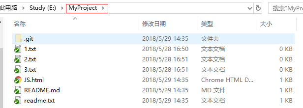
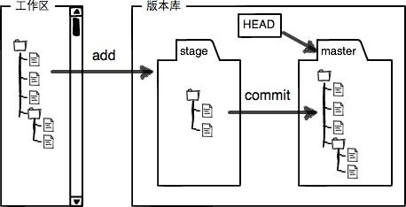
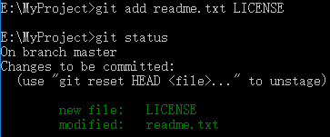
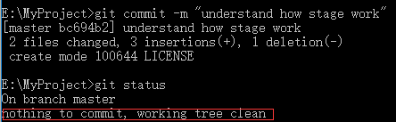

# 一、工作区（Working Directory）

就是你在电脑里能看到的目录，比如我的 `MyProject `文件夹就是个工作区

# 二、 版本库（Repository）

工作区有一个隐藏目录`.git`，是 Git 的版本库

Git 的版本库里存了很多东西

- 最重要的就是称为 `stage（或者叫 index）`的`暂存区
- 还有 Git 为我们自动创建的第一个分支 `master`
- 以及指向 master 的一个指针叫` HEAD`

把文件往 Git 版本库里添加时分两步执行

- 用 `git add ` 把文件添加进去(实际上就是`把文件修改添加到暂存区`)
- 用 `git commit` 提交更改(实际上就是`把暂存区的所有内容提交到当前分支`)

创建 Git 版本库时，Git 自动为我们创建了唯一一个 `master` 分支，所以 `git commit` 就是往 ` master` 分支上提交更改。

需要提交的文件修改通通放到暂存区，然后一次性提交暂存区的所有修改

先对`readme.txt`做个修改，然后，在工作区新增一个 `LICENSE` 文本文件（内容随便写）

Git 非常清楚地告诉我们，`readme.txt` 被修改了，而 `LICENSE` 还从来没有被添加过，所以它的状态是 `Untracked`.

使用` git add` ，把`readme.txt`和 `LICENSE` 都添加后，用 `git status` 再查看一下：

暂存区的状态就变成这样了：

`git add ` 命令实际上就是把要提交的所有修改放到暂存区（`Stage`），然后执行 `git commit `就可以一次性把暂存区的所有修改提交到分支.

一旦提交后，如果你又没有对工作区做任何修改，那么工作区就是“干净”的：

现在版本库变成了这样，暂存区就没有任何内容了：

