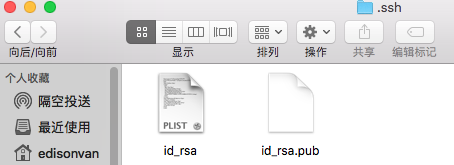
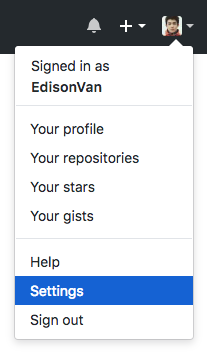
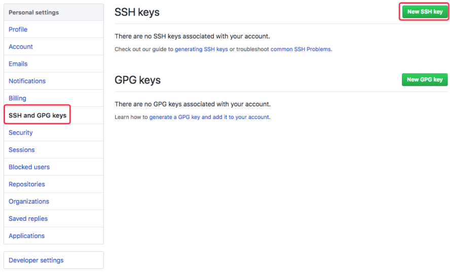
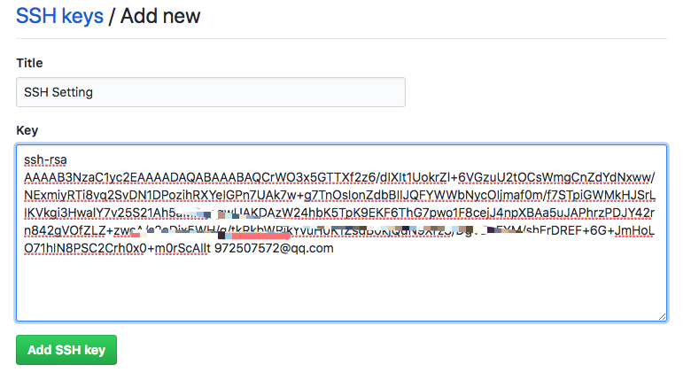
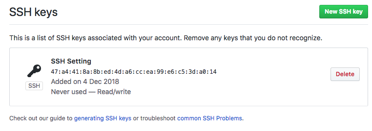
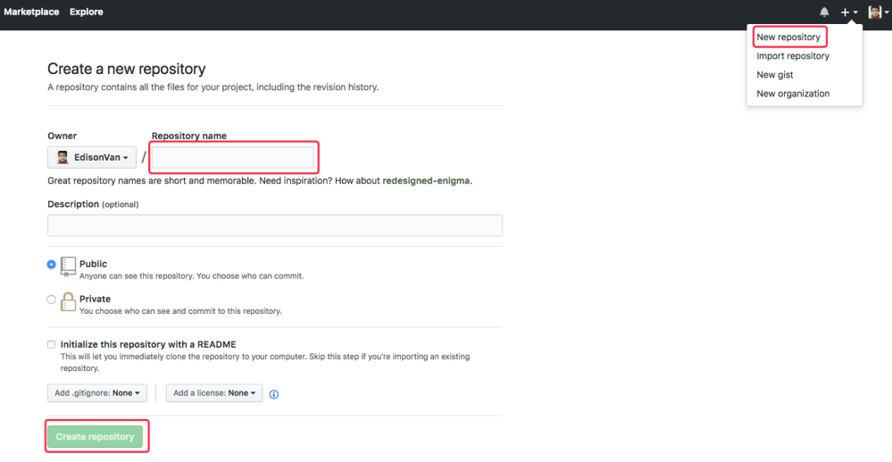
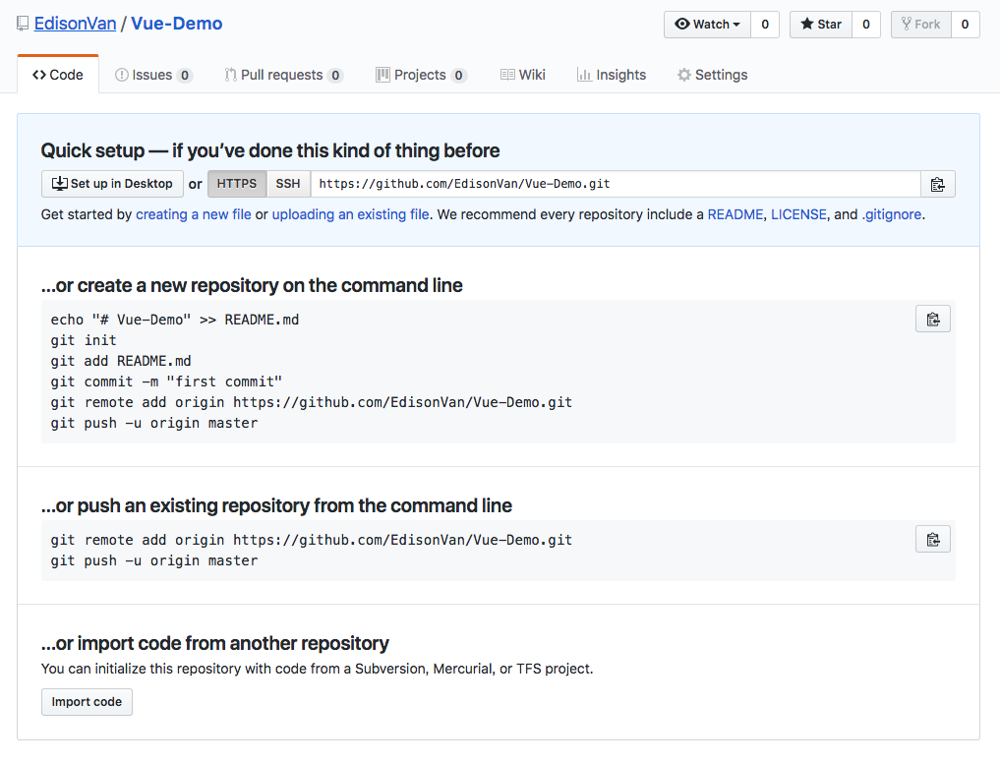
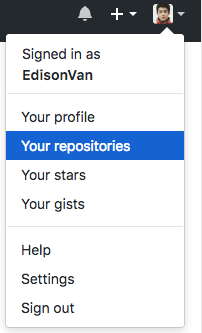
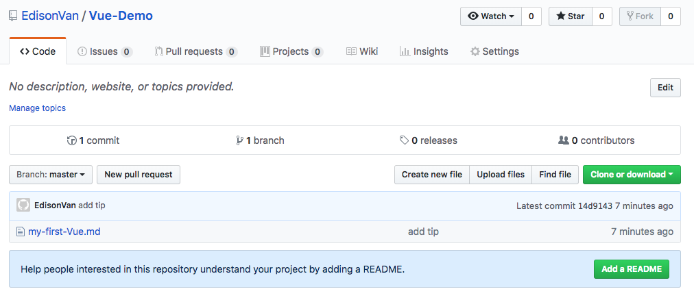

# 一、SSH 创建和 GitHub 绑定

## 第 1 步、创建 SSH Key。

在用户主目录下，看看有没有 `.ssh` 目录

- 如果有，再看看这个目录下有没有 `id_rsa` 和 `id_rsa.pub` 这两个文件，如果已经有了，可直接跳到下一步。
- 如果没有，打开 `Shell`（`Windows` 下打开 `Git Bash`），创建 `SSH Key`

```
ssh-keygen -t rsa -C "vanjohnson@foxmail.com"
```

邮件地址换成你自己的邮件地址，然后一路回车，使用默认值即可，由于这个 `Key` 也不是用于军事目的，所以也无需设置密码。

如果一切顺利的话，可以在用户主目录里找到 `.ssh` 目录，里面有 `id_rsa` 和 `id_rsa.pub` 两个文件，这两个就是 `SSH Key` 的 `秘钥对`



- id_rsa 是私钥，不能泄露出去
- id_rsa.pub 是公钥，可以放心地告诉任何人。

[MAC 如何显示和隐藏文件](https://blog.csdn.net/caoxiaohong1005/article/details/53466737)

## 第 2 步：登陆 GitHub，打开“Account settings”



- 点击`SSH and GPG Keys`
- 点击`Add SSH Key`，填上任意 Title
- 在 Key 文本框里粘贴 `id_rsa.pub` 文件的内容：





- 点`Add Key`，你就应该看到已经添加的 Key：



### 为什么 GitHub 需要 SSH Key 呢？

- 因为 GitHub 需要识别出你推送的提交确实是你推送的，而不是别人冒充的，而 Git 支持 `SSH` 协议，GitHub 只要知道了你的公钥，就可以确认只有你自己才能推送。

- GitHub 允许你添加多个 Key。假定你有若干电脑，你一会儿在公司提交，一会儿在家里提交，只要把每台电脑的 Key 都添加到 GitHub，就可以在每台电脑上往 GitHub 推送了。

- 在 GitHub 上免费托管的 Git 仓库，任何人都可以看到喔（但只有你自己才能改）。所以，不要把敏感信息放进去。
- 如果你不想让别人看到 Git 库，有两个办法:
  - 交点保护费，让 GitHub 把公开的仓库变成私有的，这样别人就看不见了（不可读更不可写）
  - 自己动手，搭一个 Git 服务器。这个方法我们后面会讲到的，相当简单，公司内部开发必备

# 二、添加远程库(GitHub 实操)

你已经在本地创建了一个 `Git 仓库`后，又想在 GitHub 创建一个 `Git 仓库`，并且让这两个仓库进行远程同步，这样，GitHub 上的仓库既可以作为备份，又可让其他人通过该仓库来协作。

##第一步

- 登陆 GitHub 在右上角找到“New repository”按钮，创建一个新的仓库：



- 在 `Repository name` 填入 `Vue-Demo` ，其他保持默认设置，点击 `Create repository` 按钮，就成功地创建了一个新的 `Git 仓库`：



- 在 GitHub 上的这个 `Vue-Demo` 仓库还是空的，GitHub 告诉我们，可以从这个仓库克隆出新的仓库，也可以把一个已有的本地仓库与之关联，然后，把本地仓库的内容推送到 GitHub 仓库。

```
注意：本地的 Vue-Demo 仓库要先初始化
```

```bash
打开终端用 git init 初始化 git 仓库
通过 git add .添加当前目录下的所有文件
记得要 git commit -m “First Push”
```

- 然后根据 GitHub 的提示，在本地的 `Vue-Demo` 仓库下运行命令：

```
git remote add origin git@github.com:EdisonVan/Vue-Demo.git
```

(注意把 EdisonVan 替换成你自己的 GitHub 账户名，否则，你在本地关联的就是我的远程库，关联没问题，但是你以后推送是推不上去的，因为你的 `SSH Key` 公钥不在我的账户列表中。)

- 添加后，远程库的名字就是 `origin`，这是 Git 默认的叫法，不建议改成别的。

```bash
常见错误：fatal: remote origin already exists.
解决方案：git remote rm origin
常见错误：Invalid username or password.
解决方案：git push 然后再次 git remote add origin git@github.com:EdisonVan/Vue-Demo.git 会提示输入密码回车即可
```

## 第二步

把本地库的所有内容推送到远程库上

```bash
git push -u origin master
Counting objects: 20, done.
Delta compression using up to 4 threads.
Compressing objects: 100% (15/15), done.
Writing objects: 100% (20/20), 1.64 KiB | 560.00 KiB/s, done.
Total 20 (delta 5), reused 0 (delta 0)
remote: Resolving deltas: 100% (5/5), done.
To github.com:michaelliao/learngit.git

- [new branch] master -> master
  Branch 'master' set up to track remote branch
  'master' from 'origin'.

```

- 把本地库的内容推送到远程，用 `git push` 命令，实际上是把当前分支 `master` 推送到远程。

- 由于远程库是空的，我们第一次推送 `master` 分支时，加上了 `-u` 参数，Git 不但会把`本地的 master` 分支内容推送的远程 `新的 master 分支` ，还会把本地的 `master` 分支和远程的 `master` 分支`关联起来`，在以后的推送或者拉取时就可以简化命令。

- 推送成功后，可以立刻在 GitHub 页面中看到远程库的内容已经和本地一模一样：





从现在起，只要本地作了提交，就可以通过命令：

```bash
git push origin master
```

把本地 `master` 分支的最新修改推送至 GitHub，现在，你就拥有了真正的分布式版本库！

# 三、SSH 警告

当你第一次使用 Git 的 `clone` 或者 `push` 命令连接 GitHub 时，会得到一个警告：

```bash
The authenticity of host 'github.com (xx.xx.xx.xx)' can't be established.
RSA key fingerprint is xx.xx.xx.xx.xx.
Are you sure you want to continue connecting (yes/no)?
```

- 这是因为 Git 使用 `SSH` 连接，而 `SSH` 连接在第一次验证 GitHub 服务器的 Key 时，需要你确认 GitHub 的 `Key` 的指纹信息是否真的来自 GitHub 的服务器
- 输入 yes 回车即可。
- Git 会输出一个警告，告诉你已经把 GitHub 的 `Key` 添加到本机的一个信任列表里了：

```
Warning: Permanently added 'github.com' (RSA) to the list of known hosts.
```

- 这个警告只会出现一次，后面的操作就不会有任何警告了
- 如果担心有人冒充 GitHub 服务器，输入 yes 前可以对照 GitHub 的 `RSA Key` 的指纹信息是否与 `SSH` 连接给出的一致。

# 四、小结

- `git remote add origin git@server-name:path/repo-name.git` 关联一个远程库

- 关联后，用 `git push -u origin master` 第一次推送 master 分支的所有内容

- 此后，每次本地提交后，只要有必要，就可以使用命令 `git push origin master` 推送最新修改
