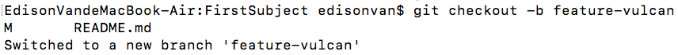
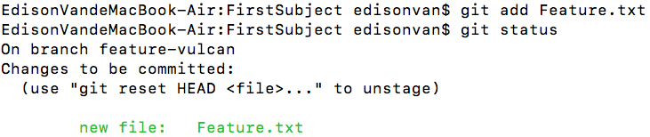
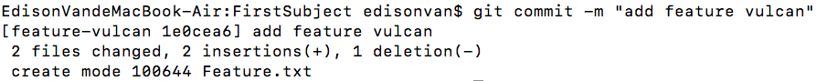
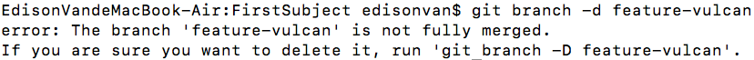
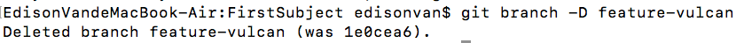

添加一个新功能时，你肯定不希望因为一些实验性质的代码，把主分支搞乱了

所以，每添加一个新功能，最好新建一个`feature`分支，在上面开发，完成后合并，最后删除该`feature`分支

- 1.你接到了一个新任务：开发代号为 `Vulcan` 的新功能，于是准备开发

```bash
git checkout -b feature-vulcan
```



5 分钟后，开发完毕：

```bash
git add Feature.txt
git status
```



```bash
git commit -m "add feature vulcan"
```



切回 `dev` ，准备合并


一切顺利的话，`feature` 分支和 `bug` 分支是类似的，合并，然后删除。

但此时，接到上级命令，因经费不足，新功能必须取消！虽然白干了，但是这个包含机密资料的分支还是必须就地销毁：

```bash
git branch -d feature-vulcan
```



销毁失败\
`feature-vulcan` 分支还没有被合并，如果删除，将丢失掉修改，如果要强行删除，需要使用大写的 `-D` 参数。。
现在 `git branch -D feature-vulcan` 强行删除



# 小结

- 开发一个新 `feature`，最好新建一个分支
- 如果要丢弃一个没有被合并过的分支，可以通过 `git branch -D <name>` 强行删除。
