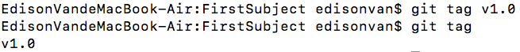
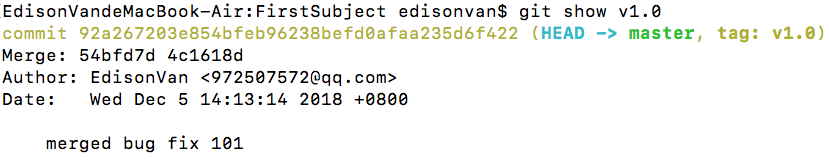
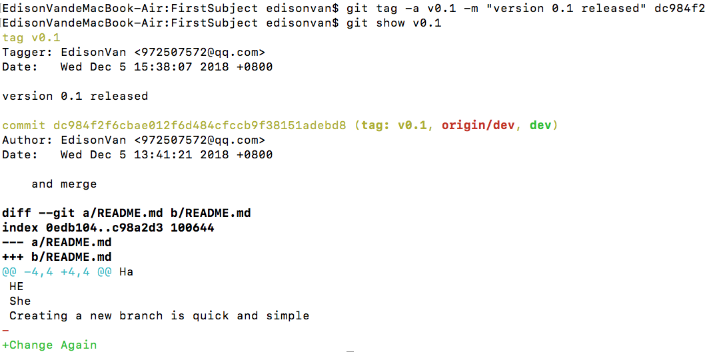

发布一个版本时通常先在版本库中打一个标签（`tag`），这样，就唯一确定了打标签时刻的版本。将来无论什么时候，取某个标签的版本，就是把那个打标签的时刻的历史版本取出来。

所以，**标签也是版本库的一个快照**

Git 的标签虽然是版本库的快照，但其实它就是指向某个 `commit` 的指针（分支可以移动，标签不能移动），所以创建和删除标签都是瞬间完成的。

Git 有 `commit`，**为什么还要引入 `tag` ？**

```bash
“请把上周一的那个版本打包发布，commit 号是 6a5819e...”
“一串乱七八糟的数字不好找！”
```

如果换一个办法：

```
“请把上周一的那个版本打包发布，版本号是 v1.2”
“好的，按照 tag v1.2 查找 commit 就行！”
```

所以，tag 就是一个让人容易记住的有意义的名字，它跟**某个** `commit` 绑在一起。

# 一、创建标签

- 1.切换到需要打标签的分支上：

```bash
git branch
* dev
  master
git checkout master
Switched to branch 'master'
```

- 2.然后，敲命令 `git tag <name>`就可以打一个新标签 `git tag v1.0`

查看所有标签：`git tag`



**默认标签是打在最新提交的 `commit` 上的**

- 3.如果忘了打标签，如现在已经是周五了，但应该在周一打的标签没有打，怎么办？
  - 方法是找到历史提交的 `commit id`，然后打上就可以了：

```bash
git log --pretty=oneline --abbrev-commit
12a631b (HEAD -> master, tag: v1.0, origin/master) merged bug fix 101
4c805e2 fix bug 101
e1e9c68 merge with no-ff
f52c633 add merge
cf810e4 conflict fixed
5dc6824 & simple
14096d0 AND simple
…
1094adb append GPL
e475afc add distributed
eaadf4e wrote a readme file
```

比方说要对 `add merge` 这次提交打标签，它对应的 `commit id` 是 `f52c633` ，敲入命令：

```bash
git tag v0.9 f52c633
```

- 4.再用命令 `git tag` 查看标签

```bash
git tag
v0.9
v1.0
```

注意，标签**不是按时间顺序列出，而是按字母排序的**。

- 5.可以用 `git show <tagname>` 查看标签信息：

```bash
git show v1.0
```



可以看到 `v1.0` 确实打在 `merged bug fix 101` 这次提交上。

- 6.还可以创建带有说明的标签
  - `-a` 指定标签名
  - `-m` 指定说明文字

```bash
git tag -a v0.1 -m "version 0.1 released" 1094adb
```

用命令 `git show <tagname>` 可以看到说明文字：

git show v0.1



注意：**标签总是和某个 `commit` 挂钩**。

如果这个 `commit` 既出现在 `master` 分支，又出现在 `dev` 分支，那么**在这两个分支上都可以看到这个标签**。

# 二、小结

- 命令 **`git tag (tagname)` **用于新建一个标签，**默认为 `HEAD`**，也可以指定一个 `commit id`
- 命令 `git tag -a (tagname) -m "blablabla..."`可以指定标签信息
- 命令 `git tag` 可以查看所有标签
