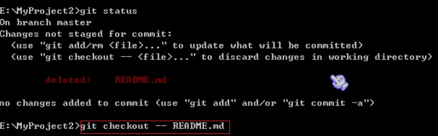

# 一、在 Git 中误删文件

# git checkout

用 `git checkout -- 文件名` 进行恢复:

`git checkout -- readme.txt` 把 `readme.txt` 文件在工作区的修改全部撤销，两种情况：

- `readme.txt` 自修改后还没有被放到暂存区，撤销修改就回到和版本库一模一样的状态

- readme.txt 已经添加到暂存区后，又作了修改，撤销修改就回到添加到暂存区后的状态

## 注意：

- `git checkout -- 文件名` 是让这个文件回到最近一次 `git commit` 或 `git add` 时的状态

- `git checkout -- file` 命令中的 `--` 很重要，没有 `--` ，就变成了“`切换到另一个分支`”的命令。

# 二、适用场景

- 当你改乱了工作区某个文件的内容，想直接丢弃工作区的修改时，用命令 `git checkout -- file`
- 当你不但改乱了工作区某个文件的内容，还添加到了暂存区时，想丢弃修改，分两步:
  - 第一步用命令 `git reset HEAD <file>`，就回到了场景一
  - 第二步按场景 1 操作 `git checkout -- file`
