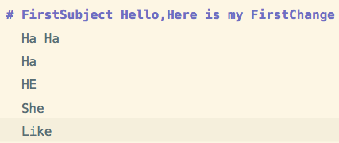
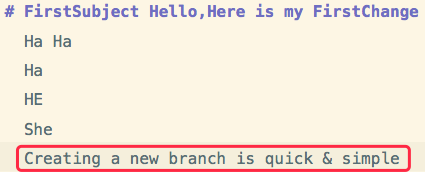
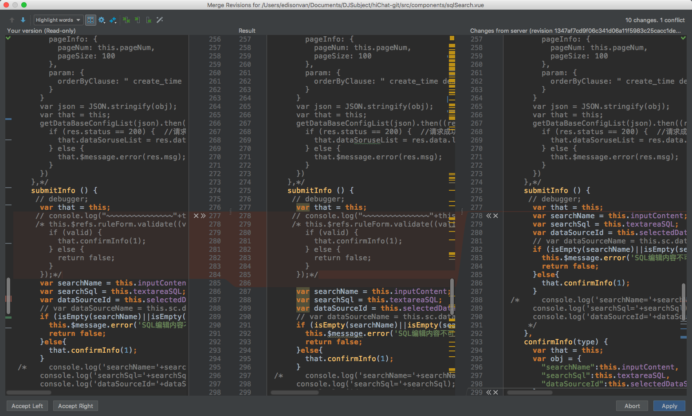

## Git 分支

创建了一个属于你自己的分支，别人看不到，还继续在原来的分支上正常工作，而你在自己的分支上干活，想提交就提交，直到开发完毕后，再一次性合并到原来的分支上，既安全，又不影响别人工作。Git 的分支是与众不同的，无论创建、切换和删除分支，Git 在 1 秒钟之内就能完成！无论你的版本库是 1 个文件还是 1 万个文件。


## 创建与合并分支

### 图解

每次提交指向 ` master` ， `HEAD` 指向的就是当前分支。
一开始的时 `master` 分支是一条线，Git 用 `master` 指向最新的提交，再用 `HEAD` 指向 master，就能确定当前分支，以及当前分支的提交点


每次提交，`master` 分支都会向前移动一步，你不断提交，`master` 分支的线也越来越长：
创建新的分支，如 `dev`，Git 新建了一个指针叫 `dev`，指向 `master` 相同的提交，再把 `HEAD` 指向 `dev`，就表示当前分支在 `dev` 上


Git 创建一个分支很快，因为除了增加一个 `dev` 指针，改改 `HEAD` 的指向，工作区的文件都没有任何变化！

从现在开始，对工作区的修改和提交就是针对 `dev` 分支了，新提交一次后，`dev` 指针往前移动一步，而 `master` 指针不变


假如我们在 dev 上的工作完成了，就可以`直接把 master 指向 dev 的当前提交` 来把 `dev` 合并到 master 上。


Git 合并分支也很快！就改改指针，工作区内容也不变！

合并完分支后，甚至可以删除 `dev` 分支。删除 `dev` 分支就是把 `dev` 指针给删掉，删掉后，我们就剩下了一条 `master` 分支


### 实战过程

- 1.用 `git checkout -b dev `先创建 `dev` 分支，然后切换到 `dev` 分支：


`git checkout` 命令加上 `-b 参数表示创建并切换`，相当于以下两条命令：

```
git branch dev
git checkout dev
```

- 2.用 `git branch` 命令查看当前分支。


- `git branch` 命令会列出所有分支，当前分支前面会标一个`\*`号。

- 3.在 `dev` 分支上正常提交，比如对 README.md 做个修改，加上一行
  `Here is my FirstChange`


然后提交


- 4.现在 `dev` 分支的工作完成，我们就可以用 `git checkout master` 切换回 `master` 分支


切换回 `master` 分支后，再查看一个 README.md 文件，刚才添加的内容不见了！因为那个提交是在 `dev` 分支上，而 `master` 分支此刻的提交点并没有变


- 5.现在用 `git merge dev` 把 `dev` 分支的工作成果合并到 `master` 分支上


`git merge` 命令用于合并指定分支到当前分支。合并后，查看 README.md 的内容，就可以看到和 `dev` 分支的最新提交完全一样。

注意到上面的 `Fast-forward` 信息，Git 告诉我们，这次合并是`快进模式`，也就是直接把 `master` 指向 `dev` 的当前提交，所以合并速度非常快。当然不是每次合并都能 `Fast-forward`。

- 6.合并完成后，就可以放心地删除 `dev` 分支了

```
git branch -d dev
```


- 7.删除后，`git branch` 查看 `branch`，就只剩下 `master` 分支了


因为创建、合并和删除分支非常快，记得`合并后再删掉分支`，这和直接在 `master` 分支上工作效果是一样的，过程更安全

### 分支重命名

```bash
git checkout <old_name>
git branch -m <new_name>
git push origin -u <new_name>
git push origin --delete <old_name>
```

### 更新远程分支列表
`git remote update origin --prune`

### 小结

- Git 鼓励大量使用分支：

```bash
查看分支：           git branch
创建分支：           git branch <name>
切换分支：           git checkout <name>
创建+切换分支:       git checkout -b <name>
合并某分支到当前分支  git merge <name>
删除分支：           git branch -d <name>
更新远程分支列表      git remote update origin --prune
```

## 解决冲突

- 1.`git checkout -b feature1` 准备新的 `feature1` 分支，继续我们的新分支开发




- 2.修改 `readme.txt` 最后一行


- 3.在 `feature1` 分支上用 `git add README.md` 和 `git commit -m "AND simple"`提交：


- 4.`git checkout master` 切换到 `master` 分支：


Git 还会自动提示我们当前 `master` 分支比远程的 `master` 分支要超前 1 个提交。

- 5.在 `master` 分支上把 README.md 文件的最后一行改为：`Creating a new branch is quick & simple.`



- 6.提交


- 7.现在，`master` 分支和 `feature1` 分支各自都分别有新的提交，变成了这样


这种情况下，Git 无法执行`快速合并`，只能试图把各自的修改合并起来，但这种合并就可能会有冲突


Git 告诉我们，README.md 文件存在冲突，必须手动解决冲突后再提交。

`git status` 也可以告诉我们冲突的文件

```
git status
```


- 8.直接查看 `readme.txt` 的内容：


Git 用`<<<<<<<`，`=======`，`>>>>>>>`标记出不同分支的内容，我们修改如下后保存：

```
Creating a new branch is quick and simple.
```

再提交


- 9.现在，`master` 分支和 `feature1` 分支变成了下图所示：


用带参数的 `git log` 也可以看到分支的合并情况：

```
git log --graph --pretty=oneline --abbrev-commit
```


最后，删除 `feature1` 分支：

```
git branch -d feature1
```


## Git 冲突解决方案

### IDEA 解决冲突

以 IDEA 开发工具为例
Upadate-Commit-Push 之后文件出现冲突
`<<<<<<<` 这个箭头代表本地的文件
`>>>>>>>` 这个箭头代表服务器的文件
删除这些箭头之后再次更新
出现这个图标
点击 Merge

在这个图片中 Your version 是自己改的
Changes from server 为服务器的
选择不需要或者需看`X >>`
`X`代表删除
`>>`代表接受
把每一个冲突全部点选之后 Result 就是最终要提交的代码
全部整改完之后 Merge，然后再次 Commit-Push 即可。

### vscode 解决冲突

1.点开冲突文件在冲突位置会有提示

Accept Current Change|Accept Incoming Change|Accept Both Changes|Compare Changes
含义依次为：
以本地代码为主|以服务器代码为主|接受本地和服务器全部代码|比较冲突 2. 修改点选每一次冲突 之后就可以合并了 3.解决冲突时切记自己和别人都改动提交的地方一定要和对方确认一下 哪些代码是不可以留的，哪些需要留着的

## 小结

- 当 Git 无法自动合并分支时，就必须首先解决冲突
- 解决冲突就是把 Git 合并失败的文件手动编辑为我们希望的内容
- 解决冲突后，再提交，合并完成
- 用 `git log --graph` 命令可以看到分支合并图。
