每个 `bug` 都可通过一个新的临时分支来修复，修复后，合并分支，然后将临时分支删除。

- 1.当你接到一个修复一个代号`101`的 bug 的任务时，你想创建一个分支 `issue-101` 来修复它，但当前正在 dev 上进行的工作还没有提交

```
git status
```

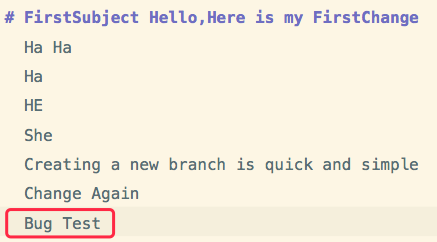

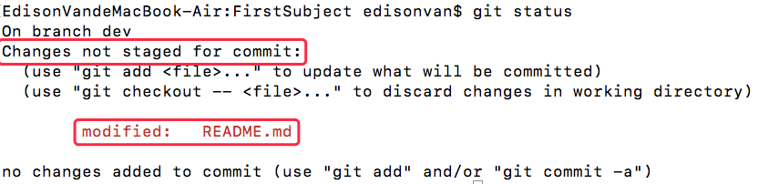

并不是你不想提交，而是工作只进行到一半，还没法提交，预计完成还需 1 天时间。但必须在两个小时内修复该 bug，怎么办？

- 2.通过 Git 提供了的 stash 功能可以把当前工作现场“储藏”起来，等以后恢复现场后继续工作

```
git stash
```

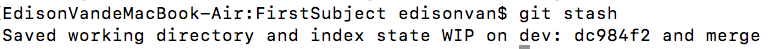

现在，用 `git status` 查看工作区，就是干净的（除非有没有被 Git 管理的文件），因此可以放心地创建分支来修复 bug。

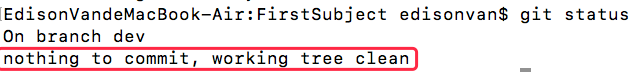

- 3.首先确定要在哪个分支上修复 bug，假定需要在 `master` 分支上修复，就从 `master` 创建临时分支：

```
git checkout master
```

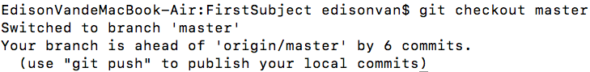

```
git checkout -b issue-101
```

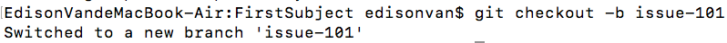

- 4.现在修复 `bug`，需要把`“Change Again”`改为`“Change Again Bug”`，然后提交

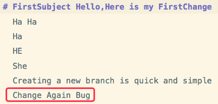

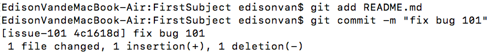

- 5.修复完成后，切换到 `master` 分支，并完成合并，最后删除 `issue-101` 分支

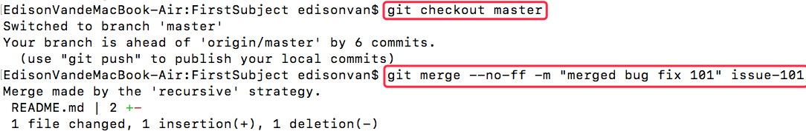

- 6.bug 修复完毕！现在回到 dev 分支干活了！

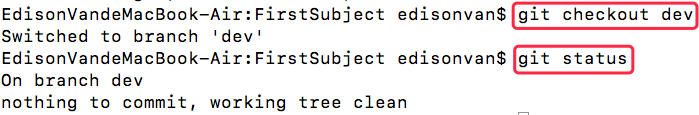

工作区是干净的，刚才的工作现场存到哪去了？用 `git stash list` 命令看看：

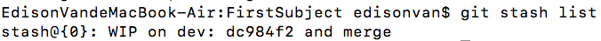

工作现场还在，Git 把 `stash` 内容存在某个地方了，但是需要恢复一下，有两个办法：

- 用 `git stash apply` 恢复，但恢复后 `stash` 内容并不删除，需要用 `git stash` drop 来删除；
- 用 `git stash pop`，恢复的同时把 `stash` 内容也删了：

```
git stash pop
```

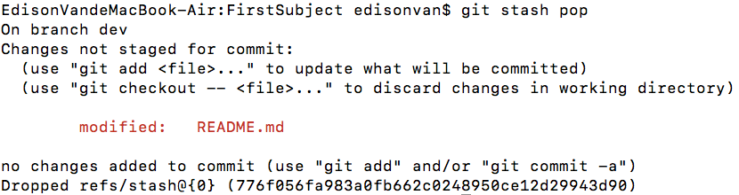

再用 `git stash list` 查看，就看不到任何 `stash` 内容了

可以多次 stash，恢复时先用 `git stash list` 查看，然后恢复指定的 `stash`
用命令:

```
git stash apply stash@{0}
```

# 小结

- 修复 bug 时，我们会通过创建新的 bug 分支进行修复，然后合并删除；
- 当手头工作没有完成时，先把工作现场 `git stash` 一下，然后去修复 bug，修复后，再 `git stash pop` 回到工作现场。
