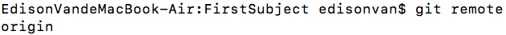
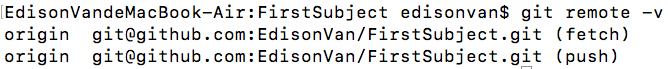
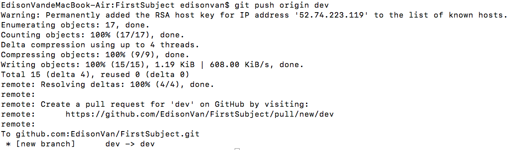

从远程仓库克隆时，实际上 Git 自动把本地的 `master` 分支和远程的 `master` 分支对应起来了，且远程仓库的**默认名称是 `origin`**。

用 `git remote` 要查看远程库的信息



或用 `git remote -v` 显示**更详细**的信息：



上面显示了可以抓取和推送的 `origin` 的地址。如果没有推送权限，就看不到 `push` 的地址。

# 一、推送分支

推送分支，就是**把该分支上的所有本地提交推送到远程库**。

推送时，**要指定本地分支，这样 Git 就会把该分支推送到远程库对应的远程分支上**

```
git push origin master
```

如果要推送其他分支，比如 `dev`，就改成：

```
git push origin dev
```



并不是一定要把本地分支往远程推送，哪些分支需要推送，哪些不需要呢？

- `master` 分支是主分支，因此**要时刻与远程同步**
- `dev` 分支是开发分支，团队所有成员都需要在上面工作，所以**也需要与远程同步**
- `bug` 分支只用于在本地修复 `bug`，就没必要推到远程了，除非老板要看看你每周到底修复了几个 `bug`；
- `feature` 分支是否推到远程，取决于你是否和你的小伙伴合作在上面开发。

在 Git 中，分支完全可以在本地自己藏着玩，是否推送，视你的心情而定！

# 二、抓取分支

多人协作时，大家都会往 `master` 和 `dev` 分支上推送各自的修改。

现在，模拟一个你的小伙伴，可以在另一台电脑（**注意要把 SSH Key 添加到 GitHub**）或者同一台电脑的另一个目录下克隆

```bash
git clone git@github.com:EdisonVan/FirstSubject.git
```

当她从远程库 `clone` 时，*默认情况下*只能看到本地的 `master` 分支。

```bash
git branch
* master
```

现在她要在 `dev` 分支上开发，就必须**创建远程 origin 的 dev 分支到本地**，于是她用这个命令创建本地 `dev` 分支

```
  git checkout -b dev origin/dev
```

现在，她就可以在 dev 上继续修改，然后时不时地把 dev 分支 push 到远程：

```bash
  git add env.txt
  git commit -m "add env"
  git push origin dev
```

她已经向 `origin/dev` 分支推送了他的提交，而碰巧你也对同样的文件作了修改，并试图推送：

```bash
  cat env.txt
  env
  git add env.txt
  git commit -m "add new env"
  git push origin dev
  ……
  error: failed to push some refs to 'git@github.com:michaelliao/learngit.git'
  hint: Updates were rejected because the tip of your current branch is behind
  hint: 'git pull ...') before pushing again.
  hint: See the 'Note about fast-forwards' in 'git push --help' for details.
```

推送失败，因为她的最新提交和你试图推送的提交**有冲突**

**解决办法**：

- 1.先用 `git pull` **把最新的提交从 `origin/dev` 抓下来，然后在本地合并，解决冲突，再推送**：
  ```bash
  git pull
  There is no tracking information for the current branch.
  Please specify which branch you want to merge with.
  See git-pull(1) for details.
  git pull <remote> <branch>
  If you wish to set tracking information for this branch you can do so with:
  git branch --set-upstream-to=origin/<branch> dev
  ```
- 2. `git pull` 也失败，原因是没有指定本地 `dev` 分支与远程 `origin/dev` 分支的链接，按提示**设置 `dev` 和 `origin/dev` 的链接**

```bash
  git branch --set-upstream-to=origin/  dev dev
  Branch 'dev' set up to track remote branch 'dev' from 'origin'.
```

- 3.再 `pull`

```bash
git pull
Auto-merging env.txt
CONFLICT (add/add): Merge conflict in env.txt
Automatic merge failed; fix conflicts and then commit the result.
```

- 4.这回 `git pull` 成功，但合并有冲突，需手动解决，**解决的方法和分支管理中的解决冲突完全一样**。解决后提交，再 `push`：

```bash
  git commit -m "fix env conflict"
  [dev 57c53ab] fix env conflict
  git push origin dev
  Counting objects: 6, done.
  Delta compression using up to 4 threads.
  Compressing objects: 100% (4/4), done.
  Writing objects: 100% (6/6), 621 bytes | 621.00 KiB/s, done.
  Total 6 (delta 0), reused 0 (delta 0)
  To github.com:michaelliao/learngit.git
  7a5e5dd..57c53ab dev -> dev
```

# 三、多人协作的工作模式通常流程

- 1.尝试用 `git push origin <branch-name>` 推送自己的修改；

  - **推送失败**，则因为远程分支比你的本地更新，需要先用 `git pull` 试图合并；
  - 如果**合并有冲突**，则解决冲突，并在本地提交；

- 2.没有冲突或者解决掉冲突后，再用 `git push origin <branch-name>` 推送就能成功！

- 3.如果 `git pull` 提示 `no tracking information` ，则说明**本地分支和远程分支的链接关系没有创建**
  - 用命令 `git branch --set-upstream-to <branch-name> origin/<branch-name>`
  - 如：将本地分支和远程分支 `sifan` 进行关联 `git branch –set-upstream-to=origin/sifan`

# 四、小结

- 用 **git remote -v** 查看远程库信息
- 本地**新建的分支如果不推送到远程**，对**其他人就是不可见**
- 从**本地推送分支**，使用 `git push origin branch-name`
- 如果**推送失败**，先用 `git pull` 抓取远程的新提交；
- **在本地创建和远程分支对应的分支**，使用 `git checkout -b branch-name origin/branch-name` ，**本地和远程分支的名称最好一致**
- 用 `git branch --set-upstream branch-name origin/branch-name` **建立本地分支和远程分支的关联**
- 用 `git pull` 从远程抓取分支，如果有冲突，要先处理冲突。
