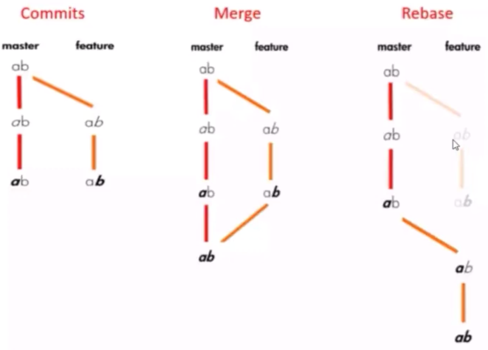

## rebase 和 merge 的区别

- merge:取不同的内容放置到自己的 branch 上，会保留被获取 branch 的历史 commit 记录（按照原本时间进行保留），会混入他人的 chekin，merge 会导致不同分支间的交叉，容易把他人代码当成自己的代码，不便于进行 CodeReview
e.g. 2 个 branch 之间有别人的提交修改，merge 之后无法清晰的区分谁写的那一部分，张三提交 3 次，李四提交 4 次，张三再次提交 3 次，如果都是通过 merge 的方式，很难查看谁提交了那段代码
- rebase：会将自己的修改放到最前面，自己分支不会保留其他分支的 check in，rebase 做的是将自己做的内容，在其他分支没有的，全部挪到分支最前方，自己改动的内容无论改动时间都会放到一个区间段中，便于他人检查代码，e.g. rebase 能保证修改内容都存放到一个连续的位置，方便他人查找问题
- squash merge：将多次提交，作为一个 merge 进行合并
- gitFlow/代码树



## Rebase

多人在同一个分支上协作时，容易出现冲突，即使没有冲突，后 `push` 的童鞋不得不先 `pull` ，在本地合并，然后才能 `push` 成功，每次合并再 `push` 后，分支变成了这样：

```bash
git log --graph --pretty=oneline --abbrev-commit # 以单行的方式显示每个提交的信息、图形化的方式查看 Git 提交历史记录
# --graph: 以图形化的方式显示提交历史的分支结构。该选项会在提交历史中显示分支、合并等信息
# --pretty=oneline: 以单行的方式显示每个提交的信息。该选项会将每个提交缩短为一行,只显示提交 ID 的缩写和提交说明
# --abbrev-commit: 使用提交 ID 的缩写版本,而不是显示完整的 40 个字符的提交 ID。这样可以使输出更加简洁易读

- d1be385 (HEAD -> master, origin/master) init hello
- e5e69f1 Merge branch 'dev'
  |\
  | _ 57c53ab (origin/dev, dev) fix env conflict
  | |\
  | | _ 7a5e5dd add env
  | \* | 7bd91f1 add new env
  | |/
- | 12a631b merged bug fix 101
  |\ \
  | \* | 4c805e2 fix bug 101
  |/ /
- | e1e9c68 merge with no-ff
  |\ \
  | |/
  | \* f52c633 add merge
  |/
- cf810e4 conflict fixed
```

其实 Git 的提交历史可以是一条干净的直线，从实际问题出发，看看怎么把分叉的提交变成直线

- 1.在和远程分支同步后，对 `hello.py` 这个文件做了两次提交。用 `git log` 命令看看：

```bash
  git log --graph --pretty=oneline --abbrev-commit
- 582d922 (HEAD -> master) add author
- 8875536 add comment
- d1be385 (origin/master) init hello
- e5e69f1 Merge branch 'dev'
  |\
  | _ 57c53ab (origin/dev, dev) fix env conflict
  | |\
  | | _ 7a5e5dd add env
  | \* | 7bd91f1 add new env
  ...
```

注意到 Git 用 `(HEAD -> master)`和`(origin/master)` 标识出当前分支的 `HEAD` 和远程 `origin` 的位置分别是 `582d922 add author` 和 `d1be385 init hello`，**本地分支比远程分支快两个提交**

- 2.现在尝试推送本地分支：

```bash
git push origin master
To github.com:EdisonVan/FirstSubject.git
! [rejected] master -> master (fetch first)
error: failed to push some refs to 'git@github.com:EdisonVan/FirstSubject.git'
hint: Updates were rejected because the remote contains work that you do
hint: not have locally. This is usually caused by another repository pushing
hint: to the same ref. You may want to first integrate the remote changes
hint: (e.g., 'git pull ...') before pushing again.
hint: See the 'Note about fast-forwards' in 'git push --help' for details.
```

失败了,说明有人先于推送了远程分支。

- 3.按照经验，先 `pull` 一下

```bash
git pull
remote: Counting objects: 3, done.
remote: Compressing objects: 100% (1/1), done.
remote: Total 3 (delta 1), reused 3 (delta 1), pack-reused 0
Unpacking objects: 100% (3/3), done.
From github.com:michaelliao/learngit
d1be385..f005ed4 master -> origin/master

- [new tag] v1.0 -> v1.0
  Auto-merging hello.py
  Merge made by the 'recursive' strategy.
  hello.py | 1 +
  1 file changed, 1 insertion(+)
```

- 4.再用 `git status` 看看状态：

```bash
git status
On branch master
Your branch is ahead of 'origin/master' by 3 commits.
(use "git push" to publish your local commits)
nothing to commit, working tree clean
```

加上刚才合并的提交，现在本地分支比远程分支超前 3 个提交。

- 5.用 `git log` 看看：

```bash
git log --graph --pretty=oneline --abbrev-commit

- e0ea545 (HEAD -> master) Merge branch 'master' of github.com:michaelliao/learngit
  |\
  | \* f005ed4 (origin/master) set exit=1
- | 582d922 add author
- | 8875536 add comment
  |/
- d1be385 init hello
  ...
```

对强迫症童鞋来说，现在事情有点不对头，提交历史分叉了。如果现在把本地分支 push 到远程,不好看。这时 **rebase** 就派上了用场。

- 6.输入命令 `git rebase` 试试：

```bash
  git rebase
  First, rewinding head to replay your work on top of it...
  Applying: add comment
  Using index info to reconstruct a base tree...
  M hello.py
  Falling back to patching base and 3-way merge...
  Auto-merging hello.py
  Applying: add author
  Using index info to reconstruct a base tree...
  M hello.py
  Falling back to patching base and 3-way merge...
  Auto-merging hello.py

```

再用 `git log` 看看效果：

```bash
  git log --graph --pretty=oneline --abbrev-commit

- 7e61ed4 (HEAD -> master) add author
- 3611cfe add comment
- f005ed4 (origin/master) set exit=1
- d1be385 init hello
  ...
```

原本分叉的提交现在变成一条直线了！

**原理**

- Git 把本地的提交“挪动”了位置，放到了 `f005ed4 (origin/master) set exit=1` 之后，这样，整个提交历史就成了一条直线。
- `rebase` 操作前后，最终的提交内容是一致的，但本地的 `commit` 修改内容已经变化了，它们的修改不再基于 `d1be385 init hello`，而是基于 `f005ed4 (origin/master) set exit=1`，但最后的提交 `7e61ed4` 内容是一致的。
- 这就是 **`rebase` 操作的特点**：把分叉的提交历史“整理”成一条直线，看上去更直观。缺点是本地的分叉提交已经被修改过了。

- 7.最后，通过 `push` 操作把本地分支推送到远程：

```bash
  Mac:~/learngit michaelgit push origin master
  Counting objects: 6, done.
  Delta compression using up to 4 threads.
  Compressing objects: 100% (5/5), done.
  Writing objects: 100% (6/6), 576 bytes | 576.00 KiB/s, done.
  Total 6 (delta 2), reused 0 (delta 0)
  remote: Resolving deltas: 100% (2/2), completed with 1 local object.
  To github.com:michaelliao/learngit.git
  f005ed4..7e61ed4 master -> master
```

- 8.再用 `git log` 看效果

```bash
git log --graph --pretty=oneline --abbrev-commit

- 7e61ed4 (HEAD -> master, origin/master) add author
- 3611cfe add comment
- f005ed4 set exit=1
- d1be385 init hello
  ...
```

远程分支的提交历史也是一条直线。

## 将连续的 commit 合并为一个


- `git rebase -i`
  - -i 参数表示交互（interactive），该命令会进入到一个可对里面的 commit 做一些操作的 Vim 编辑界面
    - 会先列出给定之前（不包括，越下面越新）的所有 commit，每个 commit 前面有一个操作命令，默认是 pick
    - 可选择不同的 commit，并修改 commit 前面的命令，来对该 commit 执行不同的变更操作


```bash
git branch -av  # 查看当前所在分支
git log --graph # 查看提交记录
git rebase -i 421fasdf # 421fasdf为对应要合并内容的前一次commit hash
# 表示将 53fsdf、12fsdf、32fsdf 三次提交统一合并到 98fsdf 这一次提交中去
pick 98fsdf feat: something # pick 指基于哪一个 commit 进行合并
s 32fsdf style: something
s 12fsdf test: something
s 53fsdf remove: something # s 即 squash：use commit, but meld into previous commit
# 输入`:wq`进行保存
# 写明合并原因
# This is a combination of 4 commits.
Write Reason Here
# 再输入`:wq`进行保存
# git log --graph # 再次查看提交日志
```

- 如果有冲突，需要修改，修改时要注意，保留最新的历史，不然的修改就丢弃了

```bash
git add .
git rebase --continue
# .如果没有冲突，或者冲突已经解决，输入wq保存并退出
```

## git rebase 支持的变更操作


- 在上面的 7 个命令中，squash 和 fixup 可用来合并 commit
  - e.g. 用 squash 来合并，只需要把要合并的 commit 前面的动词，改成 squash（或 s）即可

```bash
pick 07c5abd Introduce OpenPGP and teach basic usage
s de9b1eb Fix PostChecker::Post#urls
s 3e7ee36 Hey kids, stop all the highlighting
pick fa20af3 git interactive rebase, squash, amend
```

- rebase 后，第 2 行和第 3 行的 commit 都会合并到第 1 行的 commit。这个时，提交的信息会同时包含这三个 commit 的提交信息：

```
# This is a combination of 3 commits.
# The first commit's message is:
Introduce OpenPGP and teach basic usage

# This is the 2ndCommit Message:
Fix PostChecker::Post#urls

# This is the 3rdCommit Message:
Hey kids, stop all the highlighting
```

- 如果将第 3 行的 squash 命令改成 fixup 命令：

```
pick 07c5abd Introduce OpenPGP and teach basic usage
s de9b1eb Fix PostChecker::Post#urls
f 3e7ee36 Hey kids, stop all the highlighting
pick fa20af3 git interactive rebase, squash, amend
```

- 如果将第 3 行的 squash 命令改成 fixup 命令：

```

pick 07c5abd Introduce OpenPGP and teach basic usage
s de9b1eb Fix PostChecker::Post#urls
f 3e7ee36 Hey kids, stop all the highlighting
pick fa20af3 git interactive rebase, squash, amend
```

- rebase 后，还是会生成两个 commit，第 2 行和第 3 行的 commit，都合并到第 1 行的 commit。但，新的提交信息里面，第 3 行 commit 的提交信息会被注释掉：

```

# This is a combination of 3 commits.
# The first commit's message is:
Introduce OpenPGP and teach basic usage

# This is the 2ndCommit Message:
Fix PostChecker::Post#urls

# This is the 3rdCommit Message:
# Hey kids, stop all the highlighting
```

- 在使用 git rebase 进行操作时，注意事项：
  - 删除某个 commit 行，则该 commit 会丢失掉
  - 删除所有的 commit 行，则 rebase 会被终止掉
  - 可对 commits 进行排序，git 会从上到下进行合并

#### git rebase -i：修改某次 commit 的 message

如果想修改的 Commit Message 不是最近一次的 Commit Message，可通过 git rebase -i <父 commit ID>命令来修改。这个命令在实际开发中使用频率比较高，一定要掌握。具体来说，使用它主要分为 4 步

- 查看当前分支的日志记录

```
$ git log --oneline
1d6289f docs(docs): append test line 'update3' to README.md
a38f808 docs(docs): append test line 'update$i' to README.md
55892fa docs(docs): append test line 'update1' to README.md
89651d4 docs(doc): add README.md
```

可看到倒数第 3 次提交的 Commit Message 是：docs(docs): append test line 'update$i' to README.md，其中 update$i 正常应该是 update2

- 修改倒数第 3 次提交 commit 的 message。
  在 Git 仓库下直接执行命令 git rebase -i 55892fa，然后会进入一个交互界面。在交互界面中，修改最近一次的 Commit Message。这里使用 reword 或 r，保留倒数第 3 次的变更信息，但修改其 message，如下图所示：
  

- 修改完成后执行:wq 保存，还会跳转到一个新的交互页面，如下图所示：
  

- 修改完成后执行:wq 保存，退出编辑器之后，会在命令行显示该 commit 的 message 的更新结果：

```
[detached HEAD 5a26aa2] docs(docs): append test line 'update2' to README.md
 Date: Fri Sep 18 13:45:54 2020 +0800
 1 file changed, 1 insertion(+)
Successfully rebased and updated refs/heads/master.
```

Successfully rebased and updated refs/heads/master.说明 rebase 成功，其实这里完成了两个步骤：更新 message，更新该 commit 的 HEAD 指针。

这里一定要传入想要变更 Commit Message 的父 commit ID：git rebase -i <父 commit ID>。

- 查看倒数第 3 次 commit 的 message 是否被更新

```
$ git log --oneline
7157e9e docs(docs): append test line 'update3' to README.md
5a26aa2 docs(docs): append test line 'update2' to README.md
55892fa docs(docs): append test line 'update1' to README.md
89651d4 docs(doc): add README.md
```

可看到，倒数第 3 次 commit 的 message 成功被修改为期望的内容

- Commit Message 是 commit 数据结构中的一个属性，如果 Commit Message 有变更，则 commit ID 一定会变，git commit --amend 只会变更最近一次的 commit ID，但 git rebase -i 会变更父 commit ID 之后所有提交的 commit ID
- 如果当前分支有未 commit 的代码，需要先执行 git stash 将工作状态进行暂存，当修改完成后再执行 git stash pop 恢复之前的工作状态

### 合并提交操作示例

假设需要研发一个新的模块：user，用来在平台里进行用户的注册、登录、注销等操作，当模块完成开发和测试后，需要合并到主干分支，具体步骤如下。

- 首先，新建一个分支。需要先基于 master 分支新建并切换到 feature 分支：

```shell
$ git checkout -b feature/user
Switched to a new branch 'feature/user'
```

- 这是所有 commit 历史：

```shell
$ git log --oneline
7157e9e docs(docs): append test line 'update3' to README.md
5a26aa2 docs(docs): append test line 'update2' to README.md
55892fa docs(docs): append test line 'update1' to README.md
89651d4 docs(doc): add README.md
```

- 接着，在 feature/user 分支进行功能的开发和测试，并遵循规范提交 commit，功能开发并测试完成后，Git 仓库的 commit 记录如下：

```
$ git log --oneline
4ee51d6 docs(user): update user/README.md
176ba5d docs(user): update user/README.md
5e829f8 docs(user): add README.md for user
f40929f feat(user): add delete user function
fc70a21 feat(user): add create user function
7157e9e docs(docs): append test line 'update3' to README.md
5a26aa2 docs(docs): append test line 'update2' to README.md
55892fa docs(docs): append test line 'update1' to README.md
89651d4 docs(doc): add README.md
```

提交了 5 个 commit。接下来，需要将 feature/user 分支的改动合并到 master 分支，但 5 个 commit 太多了，想将这些 commit 合并后再提交到 master 分支。

- 接着，合并所有 commit。在上一步中，知道 fc70a21 是 feature/user 分支的第一个 commit ID，其父 commit ID 是 7157e9e，需要将 7157e9e 之前的所有分支 进行合并，可执行：

```
$ git rebase -i 7157e9e
```

- 执行命令后，会进入到一个交互界面，在该界面中，可将需要合并的 4 个 commit，都执行 squash 操作，如下图所示：
  

- 修改完成后执行:wq 保存，会跳转到一个新的交互页面，在该页面，可编辑 Commit Message，编辑后的内容如下图所示：
  
  `#`开头的行是 git 的注释，可忽略掉，在 rebase 后，这些行将会消失掉。修改完成后执行:wq 保存，就完成了合并提交操作。

- git rebase -i 这里的一定要是需要合并 commit 中最旧 commit 的父 commit ID
- 希望将 feature/user 分支的 5 个 commit 合并到一个 commit，在 git rebase 时，需要保证其中最新的一个 commit 是 pick 状态，这样才可将其他 4 个 commit 合并进去

- `然后，用如下命令来检查 commits 是否成功合并`。可看到，成功将 5 个 commit 合并成为了一个 commit：d6b17e0

```
$ git log --oneline
d6b17e0 feat(user): add user module with all function implements
7157e9e docs(docs): append test line 'update3' to README.md
5a26aa2 docs(docs): append test line 'update2' to README.md
55892fa docs(docs): append test line 'update1' to README.md
89651d4 docs(doc): add README.md
```

- `最后，就可将 feature 分支` feature/user 的改动合并到主干分支，从而完成新功能的开发

```
$ git checkout master
$ git merge feature/user
$ git log --oneline
d6b17e0 feat(user): add user module with all function implements
7157e9e docs(docs): append test line 'update3' to README.md
5a26aa2 docs(docs): append test line 'update2' to README.md
55892fa docs(docs): append test line 'update1' to README.md
89651d4 docs(doc): add README.md
```

- 如果有太多的 commit 需要合并，那么可试试这种方式：先撤销过去的 commit，然后再建一个新的

```bash
$ git reset HEAD~3
$ git add .
$ git commit -am "feat(user): add user resource"
```

除了 commit 实在太多时，一般情况下不建议用这种方法，有点粗暴，且之前提交的 Commit Message 都要重新整理一遍

## 小结

- `rebase` 操作可以把本地未 `push` 的分叉提交历史**整理成直线**
- `rebase` 的目的是使得在查看历史提交的变化时更容易，因为分叉的提交需要三方对比
