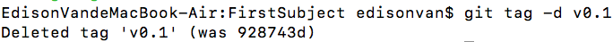

# [Git Tag](https://blog.csdn.net/QH_JAVA/article/details/77979622)

- 1.创建的标签都只存储在本地，不会自动推送到远程。**打错的标签可以在本地安全删除**

```bash
git tag -d v0.1
```



- 2.如果要**推送某个标签到远程**使用`git push origin <tagname>` 命令

```bash
git push origin v1.0
```

或**一次性推送全部尚未推送到远程的本地标签**：

```bash
git push origin --tags
```

- 3.删除远程标签

```bash
git tag -d v0.9 #先从本地删除
git push origin :refs/tags/v0.9 # 再从远程删除。删除命令也是`push`
```

# 小结

- 推送一个本地标签：**`git push origin <tagname>`**
- 推送全部未推送过的本地标签： **`git push origin --tags`**
- 删除一个本地标签：**`git tag -d <tagname>`**
- 删除一个远程标签：**`git push origin :refs/tags/<tagname>`**
