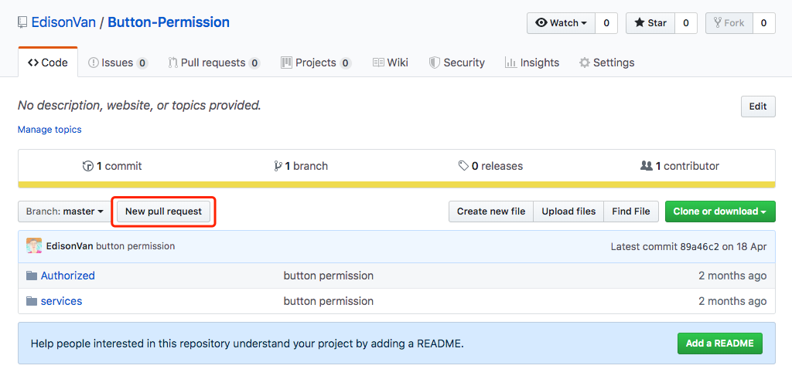

个人的开源项目，放到 GitHub 上是完全没有问题的。

GitHub 还是一个**开源协作社区**，通过 GitHub，既可以让别人参与你的开源项目，也可以参与别人的开源项目。

## 如何参与一个开源项目呢

比如 CSS 框架 `bootstrap` 项目，你可以访问[项目主页](https://github.com/twbs/bootstrap)

- 1.点 `Fork` 就在自己的账号下克隆了一个 `bootstrap` 仓库


- 2.从自己的账号下 `clone`

```bash
git clone git@github.com:EdisonVan/bootstrap.git
```

(一定要从**自己的账号**下 clone 仓库，这样才能推送修改)

Bootstrap 的官方仓库 `twbs/bootstrap` 、你在 GitHub 上克隆的仓库 `my/bootstrap` ，以及你自己克隆到本地电脑的仓库，他们的关系就像下图显示的那样：


- 如果你想修复 `bootstrap` 的一个 `bug` ，或者新增一个功能，立刻就可以开始干活，干完后，往自己的仓库推送。

- 如果你希望 `bootstrap` 的官方库能接受你的修改，你就**可以在 GitHub 上发起一个 `pull request`**。

- 如果你没能力修改 `bootstrap`，但又想要试一把 `pull request`，那就 `Fork` 一下同伴的仓库 **`https://github.com/Friends/subject`** ，创建一个 **`your-github-id.txt`** 的文本文件，然后推送一个 `pull request` 过去，同伴接受即可。

**小结**
- 在 GitHub 上，**可以任意 Fork 开源仓库**
- **自己拥有 Fork 后的仓库的读写权限**
- 可以推送 `pull request` **给官方仓库来贡献代码**

## 学习资料

**GitHub**

- [GitHub 漫游指南 Phodal Huang,黄峰达,ThoughtWorks 高级咨询师](https://github.phodal.com/#/chapter/Github%E6%BC%AB%E6%B8%B8%E6%8C%87%E5%8D%97)
- [GitHub 秘籍](https://www.bookstack.cn/read/github-cheat-sheet/README.md)

## GitHub 使用指南

快捷下载软件，找到对应仓库-releases-点击对应版本下载
- fork：拷贝别人项目到自己帐号下
- star：关注别人项目更新
- watch：设置接收邮件提醒
- issue：仓库问题、需求、修复的 bug 集合
  - 通过给 issue 打标签进行分类会更简洁

### GitHub 提 Pr 方法

一般在 fork 别人仓库之后进行代码修改，修改好了需要合并到别人的仓库中，必须要提 Pr。
所谓提 Pr 就是在 GitHub 仓库中点击`New pull request`按钮


### 组织创建(Team management)

- 建立团队
- 对不同仓库授予不同权限

### 文档(Documentation)

- GitHub Page
  - 做博客
- wikis
  - 功能说明手册

### 在 GitHub 高效查找优质项目

一个开源项目有哪些组成部分：
- name: 项目名
- description: 项目的简要描述
- 项目的源码
- README.md: 项目的详细情况的介绍

评判一个开源项目是否火热的标准：项目本身的 star 数和 fork 数

[GitHub 项目邀请（添加）成员](https://blog.csdn.net/qq_36761831/article/details/91531784)

- Advanced search(高级搜索功能)
  - Advanced options
    - Created on the dates 创建时间范围
  - Repositories options 根据仓库属性进行搜索
  - Code options 根据 Code 选项，仓库里面带.xx 后缀文件的仓库

#### 高级搜索

- `create:<2019-03-01`
  **创建在 3 月 1 日之前的仓库，<2019-03-01**
- `git 最好 学习 资料 in:readme`
  表示：搜索 git 仓库，项目 README 文件描述有关键字为‘最好 学习 资料’
  **所以自己的项目 README 文件一定要认真写**
- `git 最好 学习 资料 in:readme stars:>1000`
  代表必须大于 1000 个 Star 的项目仓库
  更多操作可以在 Advanced search 里填写设置之后再搜索
- 'after_script:'+'stage:deploy' filename:.gitlab-ci.yml
  搜索.gitlab-ci.yml 文件中包含‘after_script:’和‘stage:deploy’代码的仓库，根据 filename 进行搜索只会根据代码的内容来搜索，只会搜出代码
- `blog easily start in:readme stars:>5000`
  搜索搭建博客的仓库，且星级超过 5000 个
  搜索项目名里面包含 React 的项目:
- `in:name React`
  精确到项目的 star 数大于 5000+：
- `in:name React stars:>5000`
  按照 fork 的数量来进行搜索:
- `in:name React stars:>5000 forks:>3000`
  按照 README 来搜索 README.md 里面包含 React 的项目
- `in:readme React`
  限制一下它的 star 数和 fork 数：
- `in:readme React stars:>3000 forks:>3000`
  按照 descriptin 搜索微服务项目
- `in:description 微服务`
  增加一些筛选条件,把语言限制为 python
- `in:description 微服务 language:python`
  找到近期更新项目
- `in:description 微服务 language:python pushed:>2020-01-01`
  pushed:>2020-01-01 的意思是我们把项目的最后更新时间限制到 2020-01-01

#### 拓展

GitHub 底部的 Help 点进去有很多完备的资料可供学习使用 GitHub
Com+F 搜索`Searching for information onGitHub`可以看到更多关于 GitHub 搜索的功能

## 开源项目质量如何保证

`Pull requests`可以看自己或其他用户对开源项目的代码提交以及次数

### 个人如何向开源项目提交代码

在对应仓库下的`Pull requests`选项，点击`New pull request`来新建一个代码提交申请

- merge 进去的会是紫色
- 被拒绝的会是红色
- 在 Pull requests 下输入`is:pr is:open`进行搜索，得到的是正在申请还未被采纳合并的
- 点进请求中
  - 看`自动化测试`Checks 进行过几次，没有说明没检测，有次数点进去能看到具体检测了哪些内容
  - `Conversation`为 Code Review 时进行的讨论