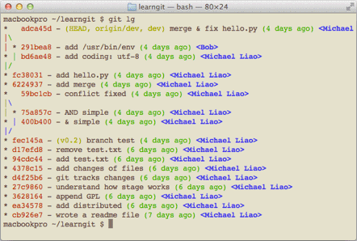

有没有经常**敲错命令**？比如 `git status` ？`status` 这个单词真心不好记。

如果 **敲 `git st` 就表示 `git status`** 那就简单多了，当然这种偷懒的办法我们是极力赞成的。

我们只需要敲一行命令，告诉 Git，以后 `st` 就表示 `status`：

```bash
git config --global alias.st status
```

当然还有别的命令可以简写，还有很多人都用 `co` 表示 `checkout`，`ci` 表示 `commit`，`br` 表示 `branch`：

```bash
git config --global alias.co checkout
git config --global alias.ci commit
git config --global alias.br branch
```

以后提交就可以简写成：

```bash
git ci -m "bala bala bala..."
```

`--global` 参数是**全局参数**，也就是这些命令**在这台电脑的所有 Git 仓库下都有用**。

`git reset HEAD file` 可以把暂存区的修改撤销掉（unstage），重新放回工作区。既然是一个 unstage 操作，就可以配置一个 `unstage` 别名：

```bash
git config --global alias.unstage 'reset HEAD'
```

当你敲入命令：

```bash
git unstage test.py
```

实际上 Git 执行的是：

```bash
git reset HEAD test.py
```

配置一个 `git last`，让其显示最后一次提交信息

```bash
git config --global alias.last 'log -1'
```

这样，用 `git last` 就能显示最近一次的提交：

```bash
git last
commit adca45d317e6d8a4b23f9811c3d7b7f0f180bfe2
Merge: bd6ae48 291bea8
Author: Michael Liao <askxuefeng@gmail.com>
Date: Thu Aug 22 22:49:22 2013 +0800
merge & fix hello.py
```

甚至还有人 "丧心病狂" 地把 `lg` 配置成了：

```bash
git config --global alias.lg "log --color --graph --pretty=format:'%Cred%h%Creset -%C(yellow)%d%Creset %s %Cgreen(%cr) %C(bold blue)<%an>%Creset' --abbrev-commit"
```

来看看 `git lg` 的效果：



# 配置文件

配置 Git 时加上 `--global` 是**针对当前用户起作用**的，**如果不加，那只针对当前的仓库**起作用。

每个仓库的 Git 配置文件都放在 **`.git/config`** 文件中：

```bash
cat .git/config
[core]
repositoryformatversion = 0
filemode = true
bare = false
logallrefupdates = true
ignorecase = true
precomposeunicode = true
[remote "origin"]
url = git@github.com:michaelliao/learngit.git
fetch = +refs/heads/_:refs/remotes/origin/_
[branch "master"]
remote = origin
merge = refs/heads/master
[alias]
last = log -1
```

别名就在 `[alias]` 后面，要删除别名，直接把对应的行删掉即可。

而当前用户的 Git 配置文件放在用户主目录下的一个隐藏文件 `.gitconfig` 中：

```bash
cat .gitconfig
[alias]
co = checkout
ci = commit
br = branch
st = status
[user]
name = Your Name
email = your@email.com
```

配置别名也可以**直接修改这个文件**，如果改错了，可以**删掉文件重新通过命令配置**。

给 Git 配置好别名，就可以输入命令时偷个懒。
