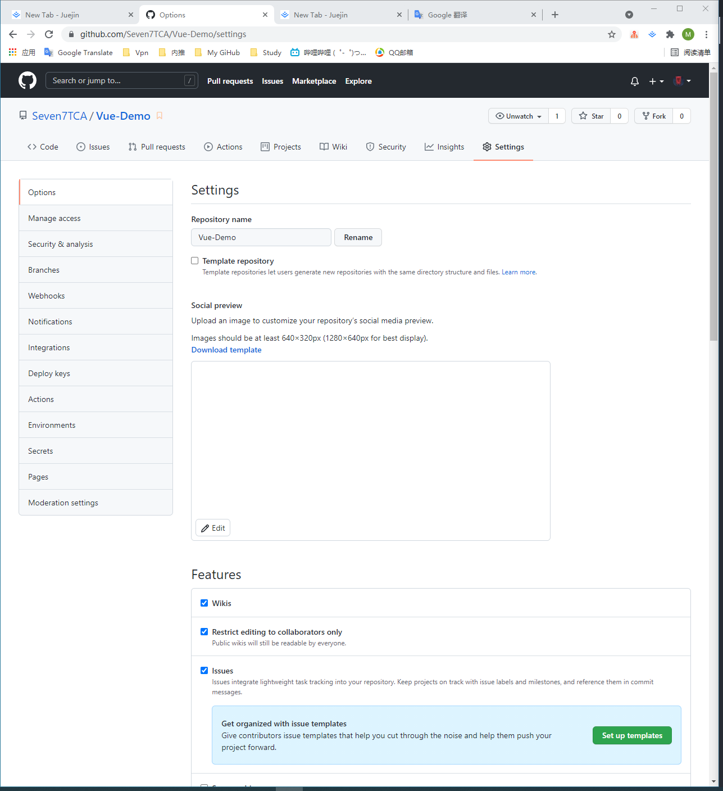

[git 为不同的项目设置不同的用户名](https://www.jianshu.com/p/d3f80a1246d6)

## 启用 issue 跟踪需求和任务

> Github issues:用来**跟踪需求、增强功能，任务，bug**等

- 1.1 任意项目->settings->Issues->Set up templates

- 1.2 任意项目->settings->Issues->Set up templates->Add template

- 1.3 Github 为我们提供了 3 种 `issue` 的模板:`Bug report`,`Feature request`,`Custom template`，根据自己的需要选择一种模板点击 **`Propose changes`**，之后 **`commit changes`**:

- 1.4 之后点击 Issues ，点击 New issue->`Get started`,取好 `Title`，就可以建立啦

- 1.5 在 Code 中可以找到建立的 issue

- 1.6 也可编辑 issue

- 1.7 在 issue 中可以找到自己创立的 issue

- 1.8 在 issue 内可以和同伴评论交流

## 如何用 project 管理 issue

- 2.1 点击 `projects`，然后 `New project`

- 2.2 根据自己需要选择模板

- 2.3 `Create` 以后，我们就建立好了一个新的 `project`，可以在里面管理或添加，也可以后续移动 issue 到不同的状态

## 项目内部怎么实施 code review

- 任意项目->Settings->branches->Add rule:
  
- 选择分支，下面有一些 review 的规则，根据自己需要选择规则。最后 Create
  

## 团队协作时如何做多分支的集成

- 任意项目->Pull requests->New pull request
  

- 选择需要合并的分支，点 Create pull request
  
- 合并有 3 种方式，`merge`，`squash and merge`，`rebase and merge`，默认 `merge`
  

- 合并后可以去 Insightes->Network 查看树状图

  

- Github 可以在线处理冲突的文件
  
- 冲突解决好后，点 Mark as resolved
  
- 之后提交解决
  
- 最后 confirm
  

## 怎样保证集成的质量

- Settings->Branches
  
- Edit
  
- 可以选择分支的名称以及集成的规则
  
- 最后 Save 一下就设置完成了
  

> 也可以通过 code review 的方式保证集成的质量
> 详见第二大点

- 也可以去商城找服务保证集成的质量
  
  > 如 Travis CI 服务
- 在 Setting 中可以看到已安装集成的服务
  
