# 一、工作区（Working Directory）

就是你在电脑里能看到的目录，比如我的 `MyProject `文件夹就是个工作区

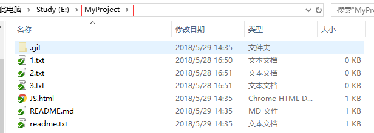

# 二、 版本库（Repository）

工作区有一个隐藏目录`.git`，是 Git 的版本库

Git 的版本库里存了很多东西

- 最重要的就是称为 `stage（或者叫 index）`的`暂存区
- 还有 Git 为我们自动创建的第一个分支 `master`
- 以及指向 master 的一个指针叫` HEAD`

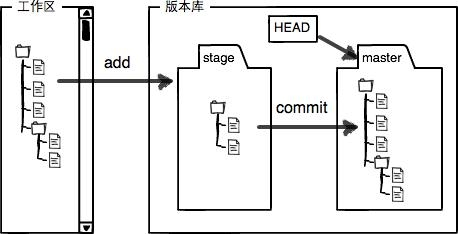

把文件往 Git 版本库里添加时分两步执行

- 用 `git add ` 把文件添加进去(实际上就是`把文件修改添加到暂存区`)
- 用 `git commit` 提交更改(实际上就是`把暂存区的所有内容提交到当前分支`)

创建 Git 版本库时，Git 自动为我们创建了唯一一个 `master` 分支，所以 `git commit` 就是往 ` master` 分支上提交更改。

需要提交的文件修改通通放到暂存区，然后一次性提交暂存区的所有修改

先对`readme.txt`做个修改，然后，在工作区新增一个 `LICENSE` 文本文件（内容随便写）

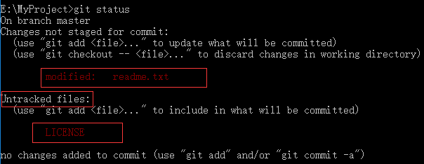

Git 非常清楚地告诉我们，`readme.txt` 被修改了，而 `LICENSE` 还从来没有被添加过，所以它的状态是 `Untracked`.

使用` git add` ，把`readme.txt`和 `LICENSE` 都添加后，用 `git status` 再查看一下：

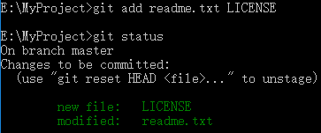

暂存区的状态就变成这样了：

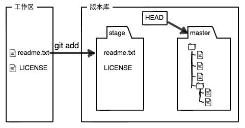

`git add ` 命令实际上就是把要提交的所有修改放到暂存区（`Stage`），然后执行 `git commit `就可以一次性把暂存区的所有修改提交到分支.

一旦提交后，如果你又没有对工作区做任何修改，那么工作区就是“干净”的：

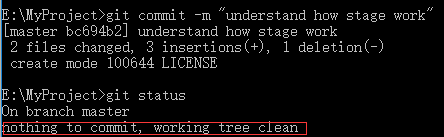

现在版本库变成了这样，暂存区就没有任何内容了：

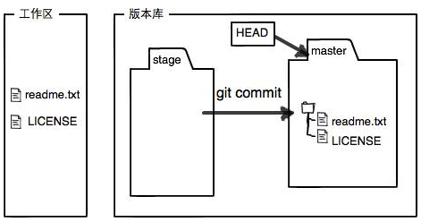

# 代码提交注意事项 （Add git）

## 代码提交推荐操作

1. git pull origin develop:sifan 从远程 develop 分支拉取代码到 sifan（自己的）分支
2. git add . 本地代码全部更改提交到缓存区
3. git commit -m "Change" 提交信息
4. git push origin sifan 推代码到自己的远程分支
5. 查看 tsf 是否 存在超前，如果存在超前需要在 tfs 上提交一个 Pr
   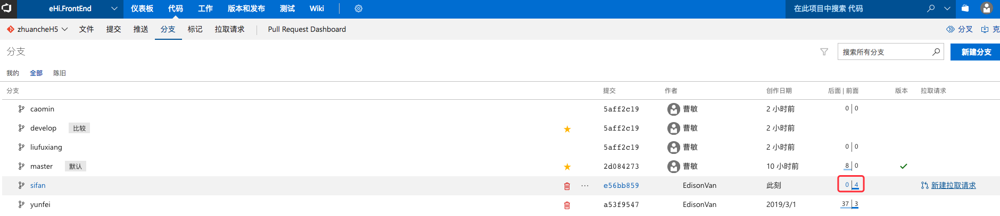
   右侧点击新建拉取请求
   选择从 sifan 到 develop 进行合并（切记不要勾选合并后删除自己的分支）
6. Pr 提交之后，再看 tfs 中超前的数字是否消失，如果消失继续接下来操作
7. git pull origin develop:sifan 从远程 develop 分支拉取代码到 sifan（自己的）分支
8. git push origin sifan / git push —set-upstream origin 再次推送代码到自己的远程分支
9. 最后再次在 tfs 检查自己是否有超前或者落后

## SourceTree 提交代码（不太推荐）

1.自己分支上修改代码先提交
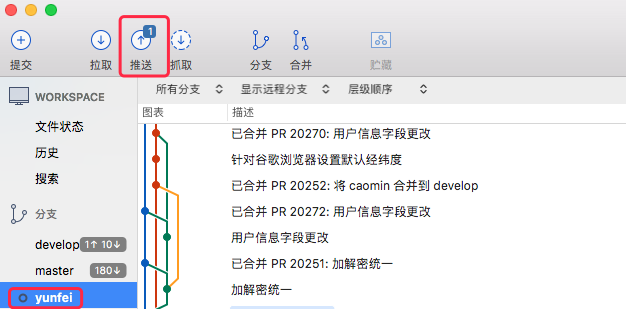 2.双击切换到 develop 分支，点击拉取代码
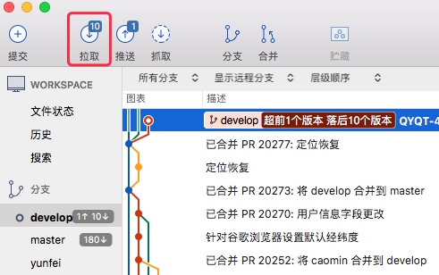 3.双击切换回自己的分支， 点击 develop 右键合并 develop 到自己的分支
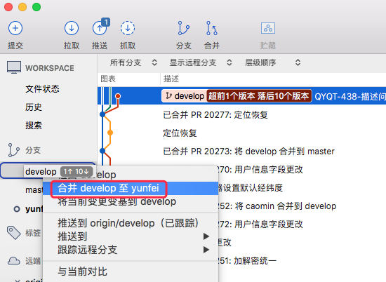 4.自己分支合并完 develop 内容后，再次推送一次
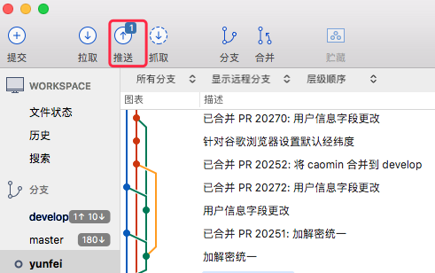 5.公司 tsf 上将自己的分支内容合并到 develop/master 上，任意一个分支中点击新建拉取请求
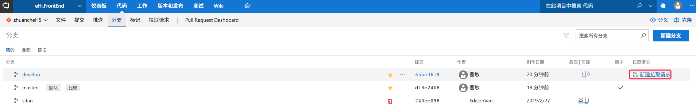 6.选择好自己的分支合并到 develop 上，点击创建
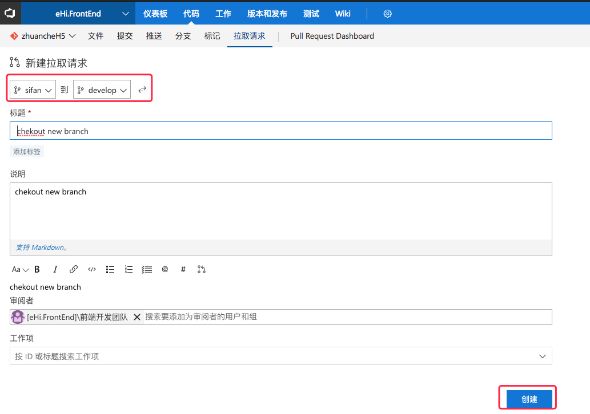 7.点击完成
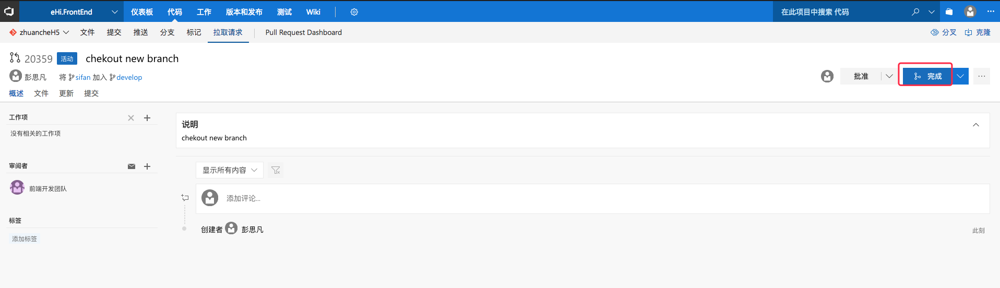 8.合并之后点生成，看自己合并的有没有生产
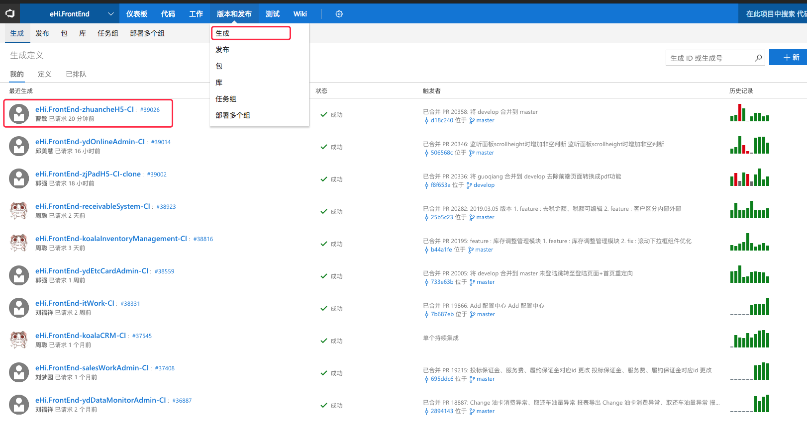 9.确定已经生产了再点击发布
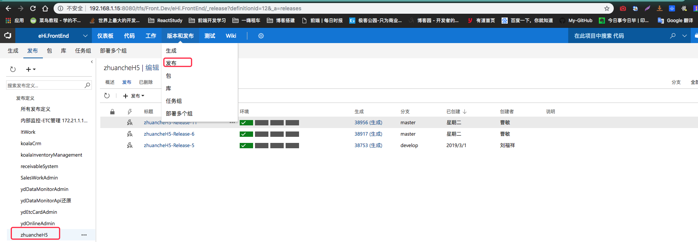 10.发布之后告知测试/后端已经发布可以部署
