## 掌握仓库当前状态

`git status`命令可以让我们时刻掌握仓库当前的状态

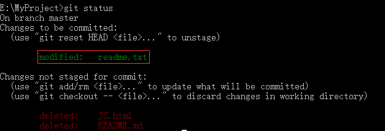

告诉我们，将要被提交的修改包括 `readme.txt`

## 查看历史提交记录(`git log`)

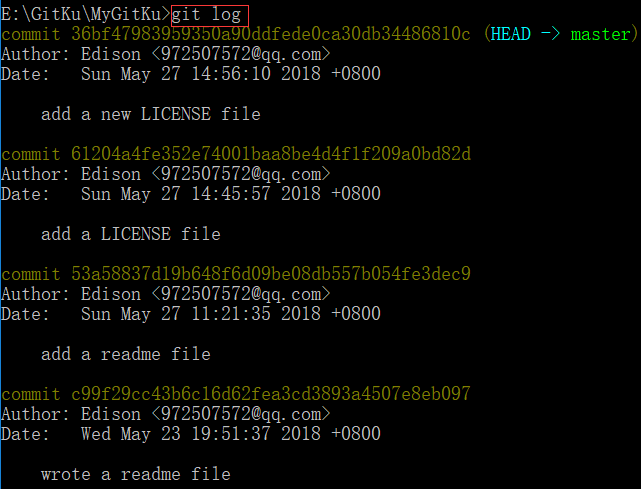

- 黄色是序号，用这种哈希值写法而不用数字 123 是因为一个开源的项目可能全世界许多程序员在一起开发，用数字表示不易分辨。

- 版本回退的前提是` Git 必须知道当前版本是哪个版本`，在 Git 中:

  - `HEAD` 表示当前版本，也就是最新的提交` 36bf479...`（注意我的提交 ID 和你的肯定不一样）
  - 上一个版本就是 HEAD~
  - 上上一个版本就是 HEAD~~
  - 当然往上 100 个版本写 100 个^比较容易数不过来，所以写成 HEAD~100

## 把当前版本回退到上个版本(`git reset`)

- `reset ` 命令的选项:

  - `git reset --mixed HEAD~`: 默认移动`HEAD`的指向， 将其指向上一个快照，将 `HEAD` 移动后指向的快照回滚到暂存区域
  - `git reset -- soft HEAD~` ：移动 `HEAD` 的指向，将其指向上一个快照，撤销上次提交，并不会改变暂存库里面的内容。
  - `git reset -- hard HEAD~ `：移动 `HEAD` 的指向，将其指向上一个快照, 将 `HEAD` 移动后指向的快照回滚到暂存区域，将暂存区域的文件还原到工作目录

用了 git reset HEAD~退回一次之后发现，add a new LICENSE file 以及消失了

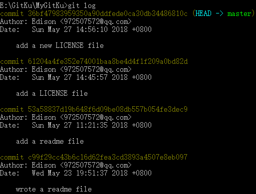
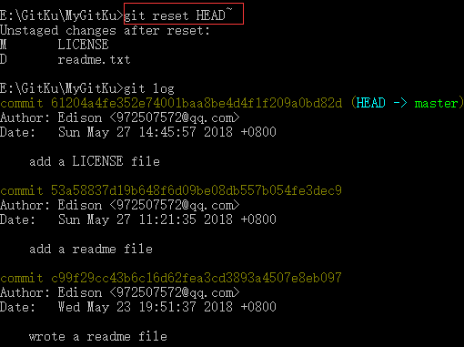

### `git reset HEAD <file>`

- `git reset` 命令既可回退版本，也可把暂存区的修改回退到工作区
- `git reset HEAD <file>`可以把暂存区的修改撤销掉（`unstage`），重新放回工作区，`HEAD` 表示最新的版本

在 Git 中删除不小心导入提交的文件:

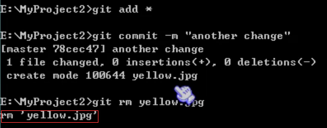

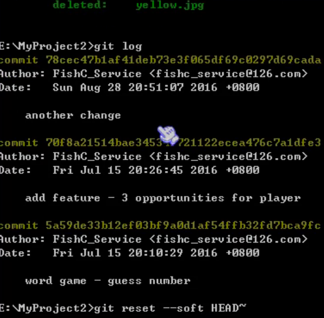

但是发现查看状态时会发现 `deleted：yellow.jpg` 这个操作，那用 `git reset –soft HEAD~` 返回过去从而让别人看不到这条记录。

## 回滚个别文件

- `git reset` 版本快照 `文件名/路径`
- `git reset` 版本快照的 ID 号（不仅可以往回滚，还可以往前滚！）

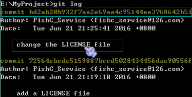

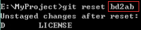

要回滚到 `change the LICENSE file` 就用 `git reset +对应草黄色的 ID`

(这里默认 `mixed` 所以仅仅是回到了暂存区，而文件目录里不会改变，`LICENSE` 也不会出现在文件目录中。那么用 `--hard` 来解决)

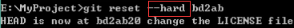

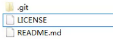

## 常见问题

如果不小心关闭了 `cmd` 窗口，找不到新版本的 `commit id`，如何用 `cmd` 查看 git 的历史记录？

```
git reflog
```

当你用 `git reset --hard HEAD^`回退到 `add distributed ` 版本时，再想恢复到 `append GPL` ，就必须找到 `append GPL` 的 `commit id` 。Git 提供了一个命令 `git reflog` 用来记录你的每一次命令：

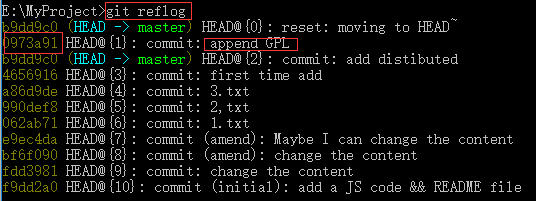

从输出可知，`append GPL` 的 `commit id` 是 0973a91，现在，你又可以乘坐时光机回到未来了!

## git revert

### git revert 仓库代码回滚

`git revert` 撤销 某次操作，此次操作之前和之后的 `commit` 和 `history` 都会保留，并且把这次撤销

作为一次最新的提交

- `git revert HEAD`             撤销前一次 `commit`
- `git revert HEAD^`            撤销前前一次 `commit`
- `git revert commit` （比如：`fa042ce57ebbe5bb9c8db709f719cec2c58ee7ff`）撤销指定的版本，撤销也会作为一次提交进行保存。

`git revert` 是提交一个新的版本，将需要 `revert` 的版本的内容再反向修改回去，

版本会递增，不影响之前提交的内容

### git revert 和 git reset 的区别

- 1. `git revert` 是**用一次新的 `commit` 来回滚之前的 `commit`** ，`git reset` 是直接**删除指定的 commit**。

- 2. 在回滚这一操作上看，效果差不多。但是在日后继续 `merge` 以前的老版本时有区别。因为 `git revert` 是用一次逆向的 `commit`“中和”之前的提交，因此日后合并老的 `branch` 时，导致这部分改变不会再次出现，但是 `git reset` 是之间把某些 `commit` 在某个 `branch` 上删除，因而和老的 `branch` 再次 `merge` 时，这些被回滚的 `commit` 应该还会被引入。

- 3. `git reset` 是把 `HEAD` 向后移动了一下，而 `git revert` 是 HEAD 继续前进，只是新的 `commit` 的内容和要 `revert` 的内容正好相反，能够抵消要被 `revert` 的内容。


## 小结

- `HEAD` 指向的版本就是当前版本
- Git 允许我们在版本的历史之间穿梭，使用命令 `git reset --hard commit id`
- 穿梭前，用 `git log` 可以查看提交历史，以便确定要回退到哪个版本
- 要重返未来，用 `git reflog` 查看命令历史，以便确定要回到未来的哪个版本。
