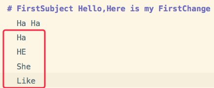
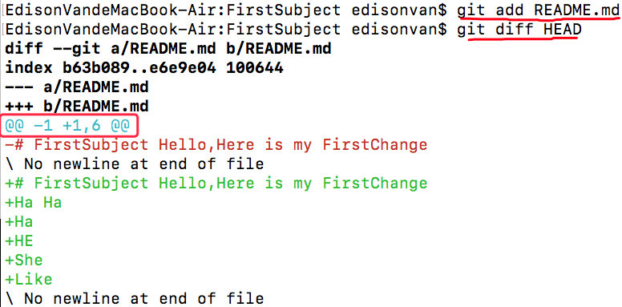

## 比较两个历史快照

- 对 README.md 新增 4 行



- 对比最新提交的内容供就用 `git diff HEAD`



`@@ -1 +1，6 @@`:
旧文件从第 1 行开始显示
新文件从第 1 行开始显示，总共显示 6 行

`@@ -7,9 +7,7 @@` :
旧文件从第 7 行开始显示，总共显示 9 行
新文件从第 7 行开始显示，总共显示 7 行

## 比较暂存区域和 Git 仓库快照

### 比较暂存区域和工作区

```
git diff –cached[快照 ID]
git diff 快照 ID1 快照 ID
```

(如 `git diff 07f22fd 5a59de` `git diff `显示的格式正是 `Unix` 通用的 `diff` 格式)

用`git diff HEAD -- readme.txt` 命令可以查看工作区和版本库里面最新版本的区别：

```
git diff HEAD -- readme.txt
diff --git a/readme.txt b/readme.txt
index 76d770f..a9c5755 100644
--- a/readme.txt
+++ b/readme.txt
@@ -1,4 +1,4 @@
Git is a distributed version control system.
…
-Git tracks changes.
+Git tracks changes of files.
```

知道了对 `readme.txt` 作了什么修改后，再把它提交到仓库就放心多了

- 第一步是 `git add`
- 再运行 `git status` 看看当前仓库的状态，`git status` 告诉我们，将要被提交的修改包括 `readme.txt`
- 放心用 `git commit` 提交了

(`index` 这行是文件 id、指定文件类型)

### 提交第二次修改的方法

- 先 `git add` 第二次修改，
- 再 `git commit` ，就相当于把两次修改合并后一块提交了
- 第一次修改 -> `git add` -> 第二次修改 -> `git add` -> `git commit`

(每次修改，如果不用 `git add` 到暂存区，就不会加入到 `commit` 中)
