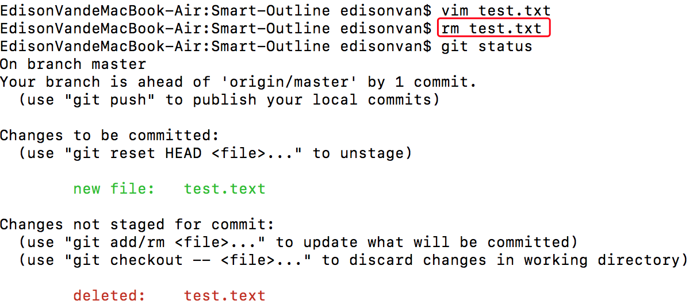
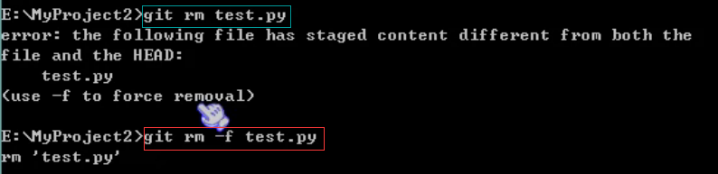

## 删除文件（git rm）

`git rm 文件名`：删除工作目录和暂存区域的文件

`git status`命令会立刻告诉你哪些文件被删除了:

如果确实要从版本库中删除该文件

- 用命令 `git rm` 删掉，并且 `git commit`
- `-f` 用于暴力删除，比如你在文件夹中添加了 text.py 文件，`commit` 一次之后又修改但是修改后没有再次 `commit`，当工作目录和暂存区域的同一个文件存在不同内容时，执行`git rm -f 文件名`命令就可以把两个都删除:

如果只删除暂存区的文件（保留工作目录的），那么执行`git rm –cached 文件名`实现

- 先手动删除文件，然后使用 `git rm <file>` 和 `git add<file>` 效果是一样的。

- 删错了就用 `git checkout -- test.txt` 把误删的文件恢复到最新版本

- (`git checkout` 其实是用版本库里的版本替换工作区的版本，无论工作区是修改还是删除，都可以`一键还原`)

## 小结

- 命令 `git rm` 用于删除一个文件
- 如果一个文件已经被提交到版本库，那么你永远不用担心误删(但是要小心，你只能恢复文件到`最新版本`，你会丢失`最近一次提交`后你修改的内容)
