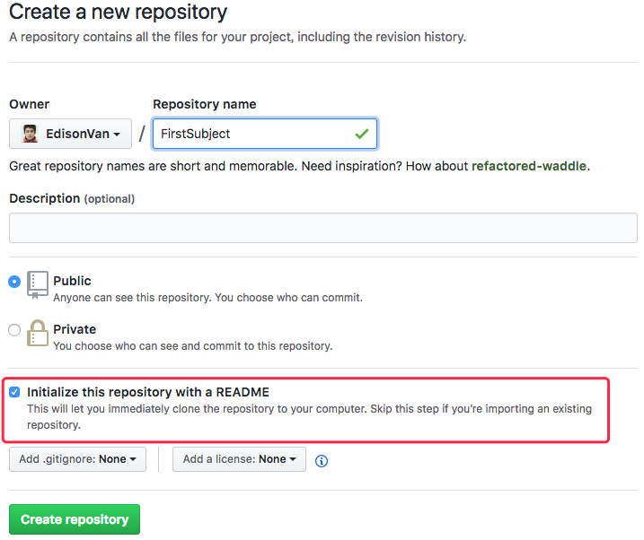
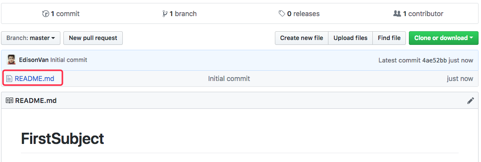

## 关联远程库
先有本地库，后有远程库时，如何关联远程库。

假设我们从零开发，那么最好的方式是先创建远程库，再从远程库克隆
- 登陆 GitHub，创建一个新的仓库，名字叫 `FirstSubject`：



- 勾选 `Initialize this repository with a README`，这样 GitHub 会自动为我们创建一个 README.md 文件。



- 远程库已经准备好了，下一步是用命令 `git clone` 克隆一个本地库：

```bash
git clone git@github.com:EdisonVan/FirstSubject.git
Cloning into 'gitskills'...
remote: Counting objects: 3, done.
remote: Total 3 (delta 0), reused 0 (delta 0), pack-reused 3
Receiving objects: 100% (3/3), done.
```

注意把 Git 库的地址换成你自己的，然后进入 `FirstSubject` 目录看看，已经有 README.md 文件了：

```
cd FirstSubject
ls
README.md
```

>注意
- 多个人协作开发，每人各自从远程克隆一份就可以了。
  - GitHub 给出的地址不止一个
- 还可以用`https://github.com/michaelliao/gitskills.git`这样的地址。
- 实际上，Git 支持多种协议，默认的 `git://`使用 `ssh` 也可使用 `https` 等其他协议
- 使用 `https` 除了速度慢以外，个最大的麻烦是每次推送都必须输入口令，但是在某些只开放 `http` 端口的公司内部就无法使用 `ssh` 协议而只能用 `https`

## 小结

- 要克隆一个仓库，首先必须知道仓库的地址，然后使用 `git clone` 命令克隆。
- Git 支持多种协议，包括 `https` ，但通过 `ssh` 支持的原生 git 协议速度最快。
