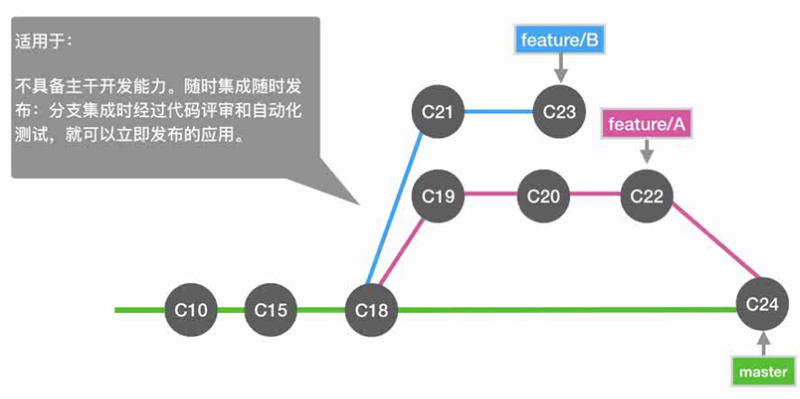
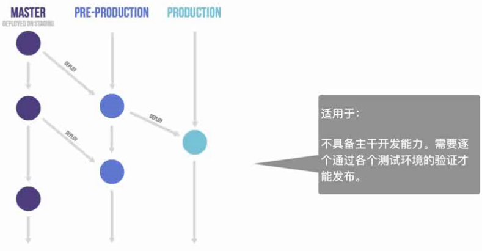
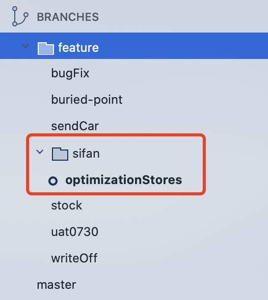

## 大型开源项目的 gitFlow

- [taro](https://github.com/NervJS/taro/network)
- [微前端框架-乾坤](https://github.com/umijs/qiankun/network)

## 考虑因素

- 团队人员的组成
- 研发设计能力
- 输出产品的特征
- 项目难易程度

### GitHub Flow



### GitLab Flow(带环境分支)



### 在 Github 选择合适的分支集成策略

insights-Network：观看版本数演进以及分支提交情况
settings-Merge button

- Allow merge commits
- Allow squash merging (适合线性模式)
- Allow rebase merging（适合严格线性模式，团队要求所以提交最后是清晰的一条时）

### Pull requests

点击`New pull request`来合并自己改动的内容到仓库
例：base:master <- compare:Sifan
代表 Sifan 分支合并回 master 分支，再点击 Create pull request 即可
建立分支合并之后 git 会自动做检查，看有无无法合并的冲突,`Rebase and merge`下拉选项有三个

- Create a merge commit (从这个分支产生的所有 commit 加入到 master(base)分支)
- Squash and merge （将当前分支的 3 个 commit 组合在一起放到 master(base)分支）
- Rebase and merge (将分支的 commit 依次有序的放置到 master(base)分支)
  下拉选择之后，再点击`Merge and request`-`Confirm merge`即可，出现紫色方框说明 merge 成功！合并成功之后可以点击`Delete branch`将当前分支删除，一般情况不建议马上删除，应该等 master 分支合并稳定一段时间再删除！

### 分支命名规范

- feature/名字/开发内容：feature/sifan/optimizationStores



## 团队内分支管理策略

- 始终保证 master 为最新代码
- 在自己开发完的功能分支：git rebase master
- rebase 解决冲突后，强推 git push —force
- 任何一个功能提交 merge 都记得先 rebase master 分支

基于远端 master 进行变基 git rebase master（针对每次 commit 进行变基）

- [通过 rerere 机制(重新利用已经被记录的一些解决方式)，让 rebase 更轻松](https://git-scm.com/book/en/v2/Git-Tools-Rerere)

Shanghai1 6ac0f1c
master 7425314
```bash
git config --global rerere.enabled true
git branch -av # 看目前所有分支状态
git checkout Shanghai # 切换到上海分支
git merge master # 让上海基于7425314这次提交的master进行merge
# 如果有冲突解决冲突后add,并commit,出现'Recorded preimage for hello.rb'就代表成功

git log -n3 # 看最近三次提交
commit 214 刚才解决冲突后的commit
commit 166
commit 121
git reset --hard 166  # 最后将shanghai分支回退到解决冲突的前一步166(Head的父亲)
# 或指定回退到 git reset --hard HEAD~1

git log -n3 # 再次检查shanghai分支是否回退成功，可以查看当前节点的效果
git branch -av # 看下分支状态
# Shanghai分支此时和远端master进行rebase,通过rerere将相同冲突只执行一次
git rebase master # 或 git rebase 742531（master的最新commit）
# 马上会出现冲突，但是这次不用再处理冲突符号
git rebase --continue # 一直持续
git add . # 自动解决的冲突
git rebase --continue # 继续rebase
git s # 查看当前分支状态，当不处于rebase时就可行了
git log --all --graph # 看所有的log状态
```

## 拓展

- [为什么 rebase 非常重要？squash merge 是什么？](https://www.bilibili.com/video/BV1cJ411k7UQ?from=search&seid=1607128149653403154)
- [git merge 和 git rebase 的区别, 切记：永远用 rebase](https://www.bilibili.com/video/BV1fJ411z7aK?from=search&seid=2118246880969624129)
