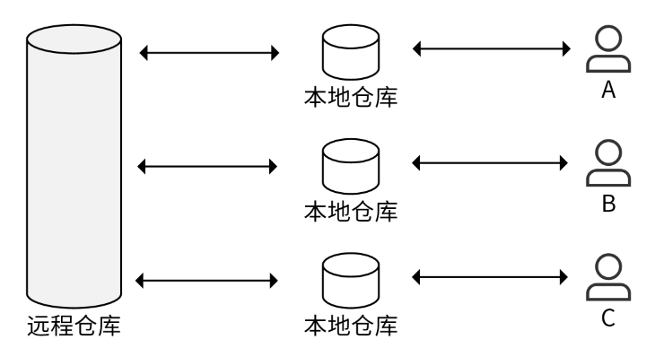
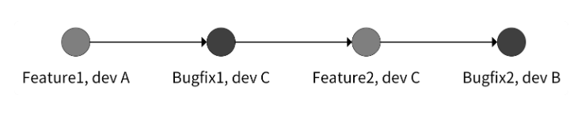
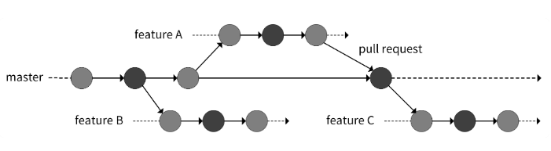
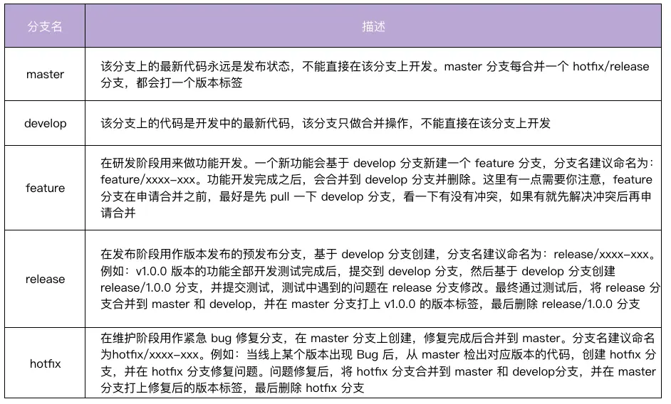
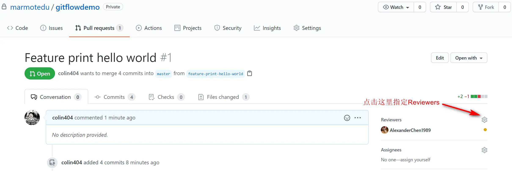
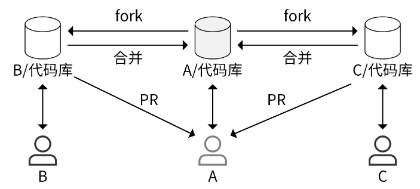
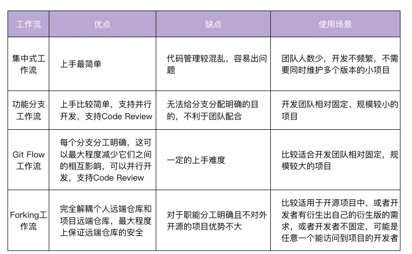

- 设计合理的开发模式
- 使用 Git 开发时，有 4 种常用的工作流，也叫开发模式，按演进顺序分为**集中式工作流**、**功能分支工作流**、**Git Flow** 工作流和 **Forking 工作流**

## 集中式工作流

工作模式：


日志：


- 每位开发者都在本地有一份远程仓库的拷贝：本地仓库
- 在本地的 `master` 分支开发完代码之后，将修改后的代码 `commit` 到远程仓库，如果有冲突就先解决本地的冲突再提交
- 最简单的一种开发方式
- 缺点：
  - 不同开发人员的提交日志混杂在一起，难以定位问题
  - 如果同时开发多个功能，不同功能同时往 master 分支合并，代码之间也会相互影响，从而产生代码冲突
  - 代码管理较混乱，容易出问题
- 适用：团队人数少、开发不频繁、不需要同时维护多个版本的小项目

## 功能分支工作流



- 基于 master 分支新建一个功能分支，在功能分支上进行开发，开发完成之后合并到 master 分支
- 可避免不同功能之间的相互影响，使提交历史看起来更加简洁
- 合并到 `master` 分支时，需要提交 PR（`pull request`），而不是直接将代码 `merge` 到 `master` 分支
  - PR 流程可把分支代码提供给团队其他开发人员进行 CR（`Code Review`），在 PR 页面讨论代码
  - PR 可确保合并到 master 的代码是健壮
  - CR 使开发者充分参与到代码的讨论中，有助于提高代码的质量，提供了一个代码变更的历史回顾途径
- 缺点：无法给分支分配明确的目的，不利于团队配合
- 适用：开发团队相对固定、规模较小的项目

**具体开发流程**

1. 基于 master 分支新建一个功能分支，功能分支可取一些有意义的名字，便于理解

```bash
git checkout -b feature/rate-limiting
```

2. 在功能分支上进行代码开发，开发完成后 commit 到功能分支

```bash
git add limit.go
git commit -m "add rate limiting"
```

3. 将本地功能分支代码 push 到远程仓库

```bash
git push origin feature/rate-limiting
```

4. 在远程仓库上创建 PR（例如：GitHub）

- 进入 GitHub 平台上的项目主页，点击 Compare & pull request 提交 PR
- 进入 PR 页面，在该页面中可根据需要填写评论，最后点击 Create pull request 提交 PR

5. 代码管理员收到 PR 后，可 CR 代码，CR 通过后，再点击 `Merge pull request` 将 PR 合并到 master。`Merge pull request` 提供了 3 种 merge 方法

- `Create a merge commit`（推荐）：GitHub 的底层操作是 `git merge --no-ff`。feature 分支上所有的 commit 都会加到 master 分支上，并且会生成一个 `merge commit`
  - 可让清晰地知道是谁做了提交，做了哪些提交，回溯历史时也会更加方便
- `Squash and merge`：GitHub 的底层操作是 `git merge --squash`。会使该 `pull request` 上的所有 commit 都合并成一个 commit 加到 master 分支上，原来的 commit 历史会丢失
- `Rebase and merge`：GitHub 的底层操作是 `git rebase`，会将 `pull request` 上的所有提交历史按照原有顺序依次添加到 master 分支的头部（HEAD）

## Git Flow 工作流

- 非开源项目中最常用到的工作流
- 定义了一个围绕项目发布的严格分支模型，通过为代码开发、发布和维护分配独立的分支来让项目的迭代流程更加顺畅
- 适合：开发团队相对固定，规模较大的项目或者迭代速度快的项目
- 缺点：有一定的上手难度
- 优点：
  - 每个分支分工明确，可最大程度减少它们之间的相互影响
  - 可创建多个分支，故可并行开发多个功能
  - 也可添加 CR ，保障代码质量

**Git Flow 的 5 种分支**



**Git Flow 开发流程**

场景如下：

- 当前版本为：0.9.0
- 需要新开发一个功能，使程序执行时向标准输出输出“hello world”字符串
- 在开发阶段，线上代码有 Bug 需要紧急修复
- 项目名为 `gitflow-demo`，项目目录下有 2 个文件，分别是 `README.md` 和 `main.go`

```go
package main
import "fmt"
func main() {
  fmt.Println("callmainfunction")
}
```

**步骤**：

1. 创建一个常驻的分支：develop

```bash
git checkout -b develop master
```

2. 基于 develop 分支，新建一个功能分支：`feature/print-hello-world`

```bash
git checkout -b feature/print-hello-world develop
```

3. `feature/print-hello-world` 分支中，在 `main.go` 文件中添加一行代码 `fmt.Println("Hello")`
4. 紧急修复 Bug

- 正处在新功能的开发中，突然线上代码发现了一个 Bug，要立即停止手上的工作，修复线上的 Bug

```bash
git stash #   1. 开发工作只完成了一半，还不想提交，可临时保存修改至堆栈区
git checkout -b hotfix/print-error master # 2. 从 master 建立 hotfix 分支
vi main.go # 3. 修复 bug，callmainfunction -> call main function
git commit -a -m 'fix print message error bug' # 4. 提交修复
git checkout develop # 5. 切换到 develop 分支
git merge --no-ff hotfix/print-error # 6. 把 hotfix 分支合并到 develop 分支
git checkout master # 7. 切换到 master 分支
git merge --no-ff hotfix/print-error # 8. 把 hotfix 分支合并到 master
git tag -a v0.9.1 -m "fix log bug" # 9. master 分支打 tag
go build -v . # 10. 编译代码，并将编译好的二进制更新到生产环境
git branch -d hotfix/print-error # 11. 修复好后，删除 hotfix/xxx 分支
git checkout feature/print-hello-world # 12. 切换到开发分支下
git merge --no-ff develop # 13. 因为 develop 有更新，这里最好同步更新下
git stash pop # 14. 恢复到修复前的工作状态
```

5. 继续开发。在 main.go 中加入 `fmt.Println("Hello World")`
6. 提交代码到 `feature/print-hello-world` 分支

```bash
git commit -a -m "print 'hello world'"
```

7. 在 `feature/print-hello-world` 分支上做 CR (code review)

- 首先，需要将 `feature/print-hello-world push` 到代码托管平台，例如 GitHub 上

```bash
git push origin feature/print-hello-world
```

- 然后，在 GitHub 上，基于 `feature/print-hello-world` 创建 PR (pull request)
- 之后就可指定 Reviewers 进行 CR (code review)
  

8. CR 通过后，由代码仓库 matainer 将功能分支合并到 develop 分支

```bash
git checkout develop
git merge --no-ff feature/print-hello-world
```

9. 基于 develop 分支，创建 release 分支，测试代码

```bash
git checkout -b release/1.0.0 develop
go build -v . # 构建后，部署二进制文件，并测试
```

10. 测试失败。要求打印 `hello world`，但打印的是 `Hello World`。直接在 `release/1.0.0` 分支修改代码，修改完成后，提交并编译部署

```bash
git commit -a -m "fix bug"
go build -v .
```

11. 测试通过后，将功能分支合并到 master 分支和 develop 分支

```bash
git checkout develop
git merge --no-ff release/1.0.0
git checkout master
git merge --no-ff release/1.0.0
git tag -a v1.0.0 -m "add print hello world"  # master 分支打 tag
```

12. 删除 `feature/print-hello-world` 分支，也可选择性删除 `release/1.0.0` 分支

```bash
git branch -d feature/print-hello-world
```

## Forking 工作流

- 开源项目中最常用到（如 Kubernetes、Docker 等项目）

**fork 操作**

- fork 操作是在个人远程仓库新建一份目标远程仓库的副本
- 流程图：



- A 拥有一个远程仓库， B 也想参与 A 项目的开发，B 可 fork 一份 A 的远程仓库到自己的 GitHub 账号下。后续 B 可在自己的项目进行开发，开发完成后，B 可给 A 提交一个 PR。这时 A 会收到通知，得知有新的 PR 被提交，A 会去查看 PR 并 CR。如果有问题，A 会直接在 PR 页面提交评论，B 看到评论后会做进一步的修改。最后 A 通过 B 的 PR 请求，将代码合并进了 A 的仓库。这样就完成了 A 代码仓库新特性的开发。项目远程仓库和开发者远程仓库完全独立，开发者通过提交 `Pull Request` 的方式给远程仓库贡献代码，项目维护者选择性地接受任何开发者的提交
- 优点：
  - 可避免授予开发者项目远程仓库的权限，从而提高项目远程仓库的安全性
  - 任意开发者都可参与项目的开发
- 局限性：对于职能分工明确且不对外开源的项目优势不大
- 适用：
  - 开源项目中，开发者有衍生出自己的衍生版的需求
  - 开发者不固定，可能是任意一个能访问到项目的开发者

**步骤**

1. Fork 远程仓库（假设目标仓库为 `gitflow-demo`）到自己的账号下

- 访问 `https://github.com/marmotedu/gitflow-demo` ，点击 fork 按钮。fork 后的仓库地址为：`https://github.com/colin404fork/gitflow-demo`

2. 克隆 fork 的仓库到本地

```bash
git clone https://github.com/colin404fork/gitflow-demo
cd gitflow-demo
git remote add upstream https://github.com/marmotedu/gitflow-demo
git remote set-url --push upstream no_push # Never push to upstream master
git remote -v # Confirm that your remotes make sense
origin  https://github.com/colin404fork/gitflow-demo (fetch)
origin  https://github.com/colin404fork/gitflow-demo (push)
upstream  https://github.com/marmotedu/gitflow-demo (fetch)
upstream  https://github.com/marmotedu/gitflow-demo (push)
```

3. 创建功能分支

- 首先，要同步本地仓库的 master 分支为最新的状态

```bash
git fetch upstream
git checkout master
git rebase upstream/master
```

- 然后，创建功能分支

```bash
git checkout -b feature/add-function
```

4. 提交 commit

```bash
git fetch upstream # commit 前需要再次同步 feature 跟 upstream/master
git rebase upstream/master
git add <file>
git status
git commit
```

- 可用 `git rebase` 来合并和修改 commit

```bash
git rebase -i origin/master
```

- 合并 commit 也可先撤销过去 5 个 commit，然后再建一个新的：

```bash
git reset HEAD~5
git add .
git commit -am "Here's the bug fix that closes #28"
git push --force
```

- squash 和 fixup 命令，还可当作命令行参数使用，自动合并 commit

```bash
git commit --fixup
git rebase -i --autosquash
```

5. push 功能分支到个人远程仓库

```bash
git push -f origin feature/add-function
```

6. 创建 `pull request`，然后请求 reviewers 进行代码 review，确认后合并到 master

- 创建 `pull request` 时，base 通常选择目标远程仓库的 master 分支

## 总结

基于 Git 的 4 种开发模式：

- 集中式工作流：开发者直接在本地 master 分支开发代码，开发完成后 push 到远端仓库 master 分支
- 功能分支工作流：开发者基于 master 分支创建一个新分支，在新分支进行开发，开发完成后合并到远端仓库 master 分支
- Git Flow 工作流：Git Flow 工作流为不同的分支分配一个明确的角色，并定义分支之间什么时、如何进行交互，比较适合大型项目的开发
- Forking 工作流：开发者先 fork 项目到个人仓库，在个人仓库完成开发后，提交 pull request 到目标远程仓库，远程仓库 review 后，合并 pull request 到 master 分支
- 本地分支关联远端分支：`git branch --set-upstream-to=origin/branch`

优缺点、适用场景：
