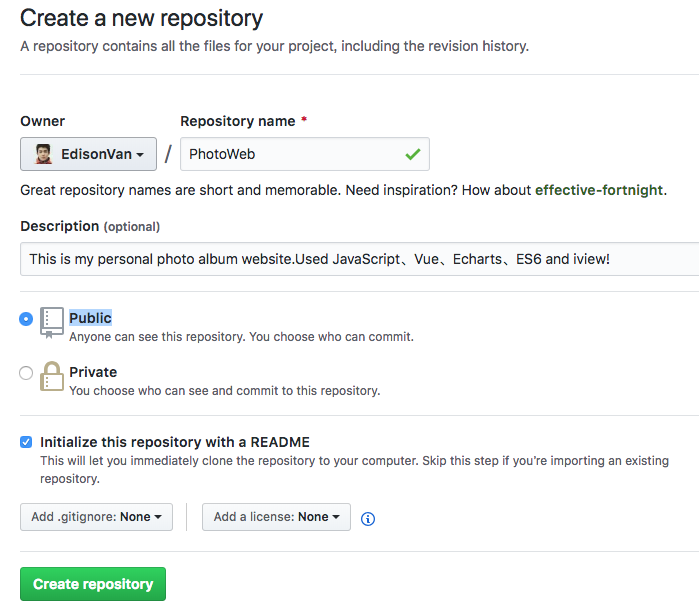
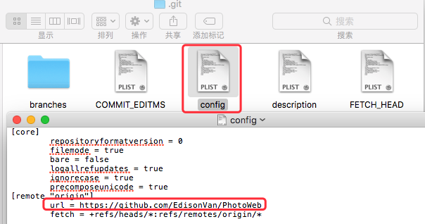
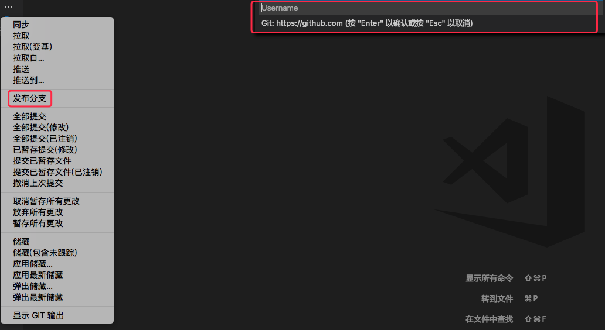
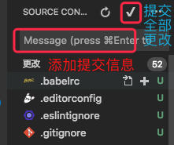
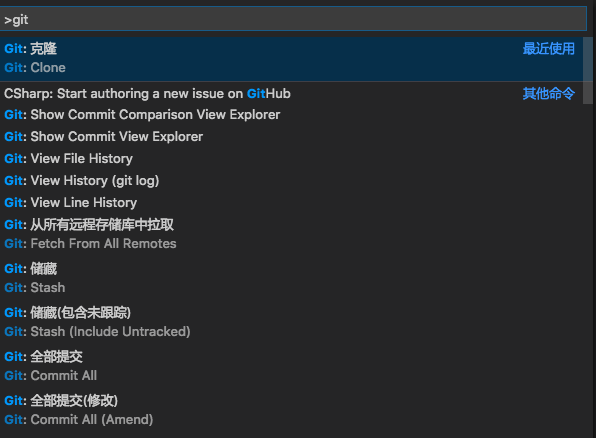

# vscode 实现 Git 版本控制

## 1.1 初始化

1. 先创建一个名为 PhotoWeb 的文件夹，当然它不在 git 的版本控制管理中。
2. 用 VS Code 打开终端（Command+shift+Y）用 git init 初始化 git 仓库 
3. 通过 git add .添加当前目录下的所有文件，通过 xxx 添加单个文件 
4. 执行上传到 git 仓库命令 git commit -m "可写注释内容"
5. vs code 左侧打开 GIT 图标，在上方有提交和刷新按钮，下拉菜单里有更多选项。 
6. 回到我们的文件中，刚才的操作创建了一个.git 文件夹，放置了当前仓库的所有配置文件


## 连接 GitHub 远程代码仓库

1.在 github 上创建一个 Repository，复制地址https://github.com/EdisonVan/PhotoWeb备用。
 2.终端执行下面命令
git remote add origin https://github.com/你的github的用户名/PhotoWeb.git（PhotoWeb.git为你创建的仓库名字加上.git）
第一次提交为防止失败先用下面这行命令将 github 上的 README.md 文件拉下来
`git pull --rebase origin master`
然后`git push -u origin master`执行推送到 master 主分支 3.现在查看一下.git 文件夹下的 config 文件，可以看到添加了远程 Reps 地址。
 4.接下来从下拉菜单中执行发布命令。会提醒我们输入账号和密码。

输入之后，会把本地提交的文件同步到 github。同步之后再打开 git 的隐藏菜单，可以看到 同步等命令可以直接使用了。

## 简化提交方法

使用 git 的 clone 命令，从远程克隆一个 Reps，然后直接用 vscode 打开文件夹，VS Code 会自动识别各项配置。

## 持久化账号（不推荐）

远程连接 git 的问题解决了，如果你不想每次同步时都输入账号信息，可全局存储账号。
Command+shift+P，输入 git config --global credential.helper wincred

## 提交保存



## git 命令列表

Command+shift+P，输入 git，会看到 VS CODE 支持的所有 git 命令。


## 撤销操作

Command+shift+P 后，输入 git undo Last Commit 撤销上次操作。输入 Unstage,撤销暂存。

## 分支

Command+shift+P 后，输入 Branch 可以创建当前内容的分支。创建分支时需要输入分支名称。

## 删除远程以及本地分支

```bash
git push origin --delete xxx
git branch -D xxx
```

## checkout

创建分支后，使用 checkout 命令可以拉取特定的分支内容。

## 冲突合并

VS Code 会检测文件冲突，并以<<<<<,>>>>,====和颜色区分出来。解决冲突之后，直接提交就行了。

## 文件比较

在 git 文件列表中，单击一个未提交更改的文件，就会打开两个窗口来显示变更的内容。

# git 版本管理工具

## 基本操作


## 提交操作


注意：使用 https 地址每次 都要输入账号密码，但是使用 SSH 就不用