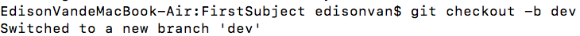
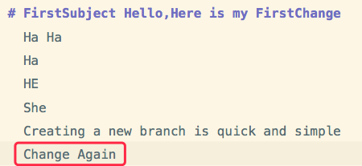
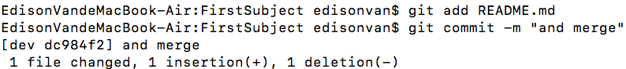
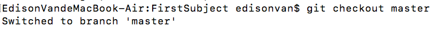
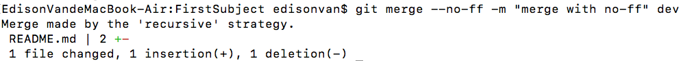
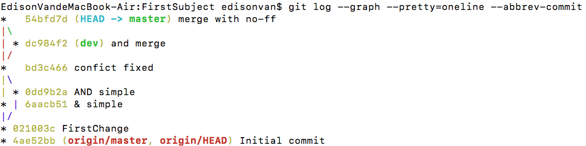
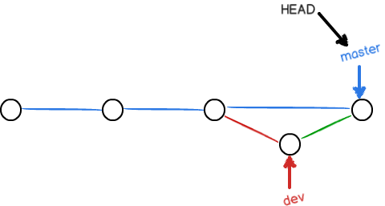
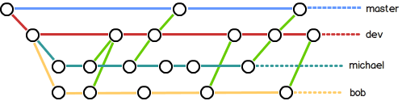

通常，合并分支时，如果可能，Git 会用`Fast forward`模式，删除分支后，会丢掉分支信息。

如果要强制禁用 `Fast forward` 模式，Git 会在`merge` 时生成一个新的 `commit` ，这样，从分支历史上就可以看出分支信息。

# 一、no-ff 方式的 git merge 实战

- 1.`git checkout -b dev` 创建并切换 dev 分支



- 2.修改 `README.md` 文件，并提交一个新的 `commit`





- 3.切换回 `master`：



- 4.准备合并 `dev` 分支，请注意 `--no-ff` 参数，表示禁用 `Fast forward`

```
git merge --no-ff -m "merge with no-ff" dev
```

因为本次合并要创建一个新的 `commit`，所以加上-m 参数，把 `commit` 描述写进去。



- 5.合并后用 `git log` 看看分支历史：

```bash
git log --graph --pretty=oneline --abbrev-commit
```



可以看到，不使用 `Fast forward` 模式， `merge` 后就像这样：



# 二、分支策略

实际开发中应该按照几个基本原则进行分支管理：

- 1.`master` 分支应该是非常稳定的，也就是仅用来发布新版本，平时不能在上面干活；
- 2.干活都在 `dev` 分支上，`dev` 分支是不稳定的，到某个时候，比如 1.0 版本发布时，再把 `dev` 分支合并到 `master` 上，在 `master` 分支发布 1.0 版本；
- 3.你和你的小伙伴们每个人都在 `dev` 分支上干活，每个人都有自己的分支，时不时地往 `dev` 分支上合并就可以了。

所以，团队合作的分支看起来就像这样：



# 三、小结

- Git 分支十分强大，在团队开发中应该充分应用。
- 合并分支时，加上`--no-ff` 参数就可以用普通模式合并,`合并后的历史有分支`，能看出来曾经做过合并
- 而 `fast forward` 合并就看不出来曾经做过合并。

# 分支被弄脏后的解决方案

- 从最新 master 分支拉取代码建立新分支
- 将原本分支需要的代码，cherry-pick 到新分支 git cherry-pick 对应 commit
- 遇到冲突，解决冲突
- 冲突解决后 git cherry-pick —continue